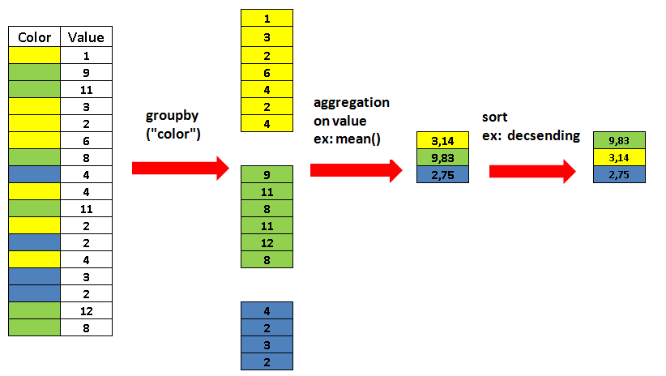

---
# Please do not edit this file directly; it is auto generated.
# Instead, please edit 01-tabular-data-pandas.md in _episodes_rmd/
title: "Reading and Working with Tabular Data"
teaching: 50
exercises: 40
questions:
  - "What is a Pandas data frame?"
  - "How do I get an overview on my tabular data?"
  - "How do I read tabular data in different formats?"
  - "How do I access subsets of a data frame?"
  - "How do I calculate simple statistics like the mean?"
objectives:
  - "Read data in various formats."
  - "Select individual values and subsections from data."
  - "Transform a data frame from messy to tidy data."
  - "Understand common data workflows (ETL) and strategies (split-apply-combine)."
keypoints:
  - "Use `pandas.read_*` and `pandas.DataFrame.to_*` to import / export data."
  - "The method `info` describes the data frame object."
  - "The method `describe` summarizes value distributions in columns."
  - "You can use labels or index locations to select both subsets and elements from your data frame."
  - "Selection using conditions is very powerful."
  - "Selections create views on your original data."
  - "Use `mean`, `max`, `min`, and others to calculate simple statistics."
  - "Use split-apply-combine to calculate statistics within groups in a data frame."
---

## Read data

We use [Pandas](https://pandas.pydata.org/) for reading, writing, and handling tabular data in Python as it is the _de facto_ standard tool to do so.

Just as `np` is by convention the alias for `numpy`, so is `pd` for `pandas`.

~~~
import pandas as pd
~~~
{: .language-python}

We start by reading some data from a comma-separated values ([CSV](https://en.wikipedia.org/wiki/Comma-separated_values)) file.

~~~
growth = pd.read_csv("data/yeast-growth.csv")
~~~
{: .language-python}

### Inspect your data

Depending on your current Python environment a `pandas.DataFrame` object will automatically be displayed as text formatted to a table or as a prettier [HTML](https://en.wikipedia.org/wiki/HTML) table.

~~~
growth
~~~
{: .language-python}

~~~
    well  timepoint     od concentration_level  concentration
0      a          1  0.017                 low           0.01
1      b          1  0.017                 low           0.03
2      c          1  0.018              medium           1.00
3      d          1  0.017              medium           3.00
4      e          1  0.017              medium          30.00
..   ...        ...    ...                 ...            ...
450    c         65  0.228              medium           1.00
451    d         65  0.221              medium           3.00
452    e         65  0.065              medium          30.00
453    f         65  0.035                high         100.00
454    g         65  0.031                high         300.00

[455 rows x 5 columns]
~~~
{: .output}

By default, the output is configured to not show too many rows and columns. We can access more specific parts of a data frame using specific methods.

The beginning of a data frame can be accessed with the `head` method.

~~~
growth.head()
~~~
{: .language-python}

~~~
  well  timepoint     od concentration_level  concentration
0    a          1  0.017                 low           0.01
1    b          1  0.017                 low           0.03
2    c          1  0.018              medium           1.00
3    d          1  0.017              medium           3.00
4    e          1  0.017              medium          30.00
~~~
{: .output}

Correspondingly, the end of a data frame can be accessed with the `tail` method.

~~~
growth.tail()
~~~
{: .language-python}

~~~
    well  timepoint     od concentration_level  concentration
450    c         65  0.228              medium            1.0
451    d         65  0.221              medium            3.0
452    e         65  0.065              medium           30.0
453    f         65  0.035                high          100.0
454    g         65  0.031                high          300.0
~~~
{: .output}

You can also ask for a random number of rows. This is great for inspection since you have a chance to see rows from different parts of the data frame. It can also be convenient to develop an analysis with a subset of your data first because it will be faster (this matters if you work with tables that contain millions of rows).

~~~
growth.sample(10)
~~~
{: .language-python}

~~~
    well  timepoint     od concentration_level  concentration
332    d         48  0.120              medium           3.00
263    e         38  0.046              medium          30.00
139    g         20  0.032                high         300.00
376    f         54  0.036                high         100.00
415    c         60  0.231              medium           1.00
424    e         61  0.063              medium          30.00
392    a         57  0.234                 low           0.01
142    c         21  0.049              medium           1.00
312    e         45  0.051              medium          30.00
12     f          2  0.015                high         100.00
~~~
{: .output}

Notice the random indices.

### Summaries

Looking at the actual values in your data is important to develop an understanding of them if you work with new data. However, in order to get an overview on your data, there are some useful summary methods.

If you just want to know the dimensions of your data frame, you can do so with the `shape` attribute.

~~~
growth.shape
~~~
{: .language-python}

~~~
(455, 5)
~~~
{: .output}

As you will see later on, it is sometimes necessary to look at the data types that pandas has inferred from your table.

~~~
growth.dtypes
~~~
{: .language-python}

~~~
well                    object
timepoint                int64
od                     float64
concentration_level     object
concentration          float64
dtype: object
~~~
{: .output}

The `info` method conveniently combines information on the shape and types in your data frame. In addition, it tells you about the index used and the memory consumption.

~~~
growth.info()
~~~
{: .language-python}

~~~
<class 'pandas.core.frame.DataFrame'>
RangeIndex: 455 entries, 0 to 454
Data columns (total 5 columns):
 #   Column               Non-Null Count  Dtype  
---  ------               --------------  -----  
 0   well                 455 non-null    object 
 1   timepoint            455 non-null    int64  
 2   od                   455 non-null    float64
 3   concentration_level  455 non-null    object 
 4   concentration        455 non-null    float64
dtypes: float64(2), int64(1), object(2)
memory usage: 17.9+ KB
~~~
{: .output}

Instead of summarizing the data frame object itself, you can get a high-level overview on the statistical distribution of your data.

~~~
growth.describe()
~~~
{: .language-python}

~~~
        timepoint          od  concentration
count  455.000000  455.000000     455.000000
mean    33.000000    0.077193      62.005714
std     18.782314    0.068110     102.928567
min      1.000000    0.015000       0.010000
25%     17.000000    0.032000       0.030000
50%     33.000000    0.042000       3.000000
75%     49.000000    0.099500     100.000000
max     65.000000    0.237000     300.000000
~~~
{: .output}

By default, this will only describe numeric columns. You can also get an overview on all columns including text and categorical columns (generally of type `object`).

~~~
growth.describe(include="all")
~~~
{: .language-python}

~~~
       well   timepoint          od concentration_level  concentration
count   455  455.000000  455.000000                 455     455.000000
unique    7         NaN         NaN                   3            NaN
top       a         NaN         NaN              medium            NaN
freq     65         NaN         NaN                 195            NaN
mean    NaN   33.000000    0.077193                 NaN      62.005714
std     NaN   18.782314    0.068110                 NaN     102.928567
min     NaN    1.000000    0.015000                 NaN       0.010000
25%     NaN   17.000000    0.032000                 NaN       0.030000
50%     NaN   33.000000    0.042000                 NaN       3.000000
75%     NaN   49.000000    0.099500                 NaN     100.000000
max     NaN   65.000000    0.237000                 NaN     300.000000
~~~
{: .output}

The `NaN` values displayed in the output are simply Pandas' concept of missing values. Just pretend that they are empty cells.

> ## Wording
>
> I try to use _data frame_ when talking about the object for computation and _table_ when talking about data more generally; but I might mix them up as in my mind they are the same concept.
{: .callout}

> ## Tangent: Tidy Data
>
> Hadley Wickham coined the concept of _tidy data_ for statistics. What _is_ tidy data?
>
> <iframe src="https://tidyr.tidyverse.org/articles/tidy-data.html#tidy-data" height="600" width="100%" data-external="1"></iframe>
>
> You can also dive into the [original publication from 2014](https://doi.org/10.18637/jss.v059.i10) but it suffices to say that a tidy data structure is more intuitive for data visualization (plotting) and statistical analysis.
{: .callout}

> ## Reading files from different locales
>
> Depending on what country's standard your computer is set to (the 'locale'), software such as Excel will use different characters to separate fields, for example, the default for a computer with the DK locale will be to use `;` to separate fields and `,` to separate decimals. Try finding the right arguments to `pandas.read_table` to get something sensible out of `"data/example-uk.txt"` and `"data/example-dk.txt"`. Use the inspection methods from before to see how pandas reads the data.
>
> ### UK
>
> > ## Solution
> >
> > 
> > ~~~
> > uk_data = pd.read_table("data/example-uk.txt")
> > uk_data
> > ~~~
> > {: .language-python}
> > 
> > 
> > 
> > ~~~
> >       name;height;age;income
> > 0       Ian;183;27;12,000.01
> > 1     Peter;162;28;11,000.50
> > 2  Bernhard;173;30;10,000.00
> > 3    Steven;163;32;12,500.00
> > ~~~
> > {: .output}
> >
> > 
> > ~~~
> > uk_data = pd.read_table("data/example-uk.txt", sep=";")
> > uk_data
> > ~~~
> > {: .language-python}
> > 
> > 
> > 
> > ~~~
> >        name  height  age     income
> > 0       Ian     183   27  12,000.01
> > 1     Peter     162   28  11,000.50
> > 2  Bernhard     173   30  10,000.00
> > 3    Steven     163   32  12,500.00
> > ~~~
> > {: .output}
> >
> > 
> > ~~~
> > uk_data.dtypes
> > ~~~
> > {: .language-python}
> > 
> > 
> > 
> > ~~~
> > name      object
> > height     int64
> > age        int64
> > income    object
> > dtype: object
> > ~~~
> > {: .output}
> >
> > 
> > ~~~
> > uk_data = pd.read_table("data/example-uk.txt", sep=";", thousands=",")
> > uk_data
> > ~~~
> > {: .language-python}
> > 
> > 
> > 
> > ~~~
> >        name  height  age    income
> > 0       Ian     183   27  12000.01
> > 1     Peter     162   28  11000.50
> > 2  Bernhard     173   30  10000.00
> > 3    Steven     163   32  12500.00
> > ~~~
> > {: .output}
> >
> > 
> > ~~~
> > uk_data.dtypes
> > ~~~
> > {: .language-python}
> > 
> > 
> > 
> > ~~~
> > name       object
> > height      int64
> > age         int64
> > income    float64
> > dtype: object
> > ~~~
> > {: .output}
> >
> {: .solution}
>
> ### DK
>
> > ## Solution
> > 
> > 
> > ~~~
> > dk_data = pd.read_table("data/example-dk.txt")
> > dk_data
> > ~~~
> > {: .language-python}
> > 
> > 
> > 
> > ~~~
> >      name;height;age;income
> > 0       Ian;183;27;12000,01
> > 1     Peter;162;28;11100,50
> > 2  Bernhard;173;30;11000,00
> > 3    Steven;163;32;12500,00
> > ~~~
> > {: .output}
> > 
> > 
> > ~~~
> > dk_data = pd.read_table("data/example-dk.txt", sep=";")
> > dk_data
> > ~~~
> > {: .language-python}
> > 
> > 
> > 
> > ~~~
> >        name  height  age    income
> > 0       Ian     183   27  12000,01
> > 1     Peter     162   28  11100,50
> > 2  Bernhard     173   30  11000,00
> > 3    Steven     163   32  12500,00
> > ~~~
> > {: .output}
> > 
> > 
> > ~~~
> > dk_data.dtypes
> > ~~~
> > {: .language-python}
> > 
> > 
> > 
> > ~~~
> > name      object
> > height     int64
> > age        int64
> > income    object
> > dtype: object
> > ~~~
> > {: .output}
> > 
> > 
> > ~~~
> > dk_data = pd.read_table("data/example-dk.txt", sep=";", decimal=",")
> > dk_data
> > ~~~
> > {: .language-python}
> > 
> > 
> > 
> > ~~~
> >        name  height  age    income
> > 0       Ian     183   27  12000.01
> > 1     Peter     162   28  11100.50
> > 2  Bernhard     173   30  11000.00
> > 3    Steven     163   32  12500.00
> > ~~~
> > {: .output}
> > 
> > 
> > ~~~
> > dk_data.dtypes
> > ~~~
> > {: .language-python}
> > 
> > 
> > 
> > ~~~
> > name       object
> > height      int64
> > age         int64
> > income    float64
> > dtype: object
> > ~~~
> > {: .output}
> > 
> {: .solution}
{: .challenge}

### Other data formats

#### Excel

When you read data from spreadsheets (`.xls`, `.xlsx`, `.ods`), you do not need to worry about field separators or number formatting (but you need extra packages such as `xlrd`, `openpyxl`, or `odfpy`).

~~~
excel_data = pd.read_excel("data/example-dk.xlsx")
excel_data
~~~
{: .language-python}

~~~
       name  height  age    income
0       Ian     183   27  12000.01
1     Peter     162   28  11100.50
2  Bernhard     173   30  11000.00
3    Steven     163   32  12500.00
~~~
{: .output}

However, you may need to be careful with Excel's interpretation of strings as dates (see [Gene name errors are widespread in the scientific literature](https://doi.org/10.1186/s13059-016-1044-7) and [Guidelines for human gene nomenclature](https://doi.org/10.1038/s41588-020-0669-3)) when loading tabular files in Excel.

Pandas will try to detect the right dependency for opening a spreadsheet.

~~~
date_data = pd.read_excel("data/example-datetime.ods")
date_data
~~~
{: .language-python}

~~~
        date      time
0 2020-03-02  03:34:23
1 2021-02-02  02:24:00
2 2021-09-01  16:01:22
~~~
{: .output}

Common date and time formats are automatically detected and converted to
suitable Python data types.

~~~
date_data.dtypes
~~~
{: .language-python}

~~~
date    datetime64[ns]
time            object
dtype: object
~~~
{: .output}

You can conveniently combine multiple columns into one datetime object.

~~~
pd.read_excel("data/example-datetime.ods", parse_dates={"datetime": ["date", "time"]})
~~~
{: .language-python}

~~~
             datetime
0 2020-03-02 03:34:23
1 2021-02-02 02:24:00
2 2021-09-01 16:01:22
~~~
{: .output}

#### Further formats

There are many more formats that Pandas can read data from. Just type `pd.read_`
and press tab to see the list of auto-completion options. A few notable ones:

* All file-based read functions accept a remote URL as an option. We could have loaded the growth data with

~~~
pd.read_csv(
    "https://raw.githubusercontent.com/data-science-for-biotech/python-pandas-viz-ml/gh-pages/_episodes_rmd/data/yeast-growth.csv"
)
~~~
{: .language-python}

~~~
    well  timepoint     od concentration_level  concentration
0      a          1  0.017                 low           0.01
1      b          1  0.017                 low           0.03
2      c          1  0.018              medium           1.00
3      d          1  0.017              medium           3.00
4      e          1  0.017              medium          30.00
..   ...        ...    ...                 ...            ...
450    c         65  0.228              medium           1.00
451    d         65  0.221              medium           3.00
452    e         65  0.065              medium          30.00
453    f         65  0.035                high         100.00
454    g         65  0.031                high         300.00

[455 rows x 5 columns]
~~~
{: .output}

* In the context of the web, `read_json` can be very handy
* Tables are often stored in SQL databases, in that case `read_sql` is your friend

## Accessing data

Let's look at our old friend the growth data table again.

~~~
growth
~~~
{: .language-python}

~~~
    well  timepoint     od concentration_level  concentration
0      a          1  0.017                 low           0.01
1      b          1  0.017                 low           0.03
2      c          1  0.018              medium           1.00
3      d          1  0.017              medium           3.00
4      e          1  0.017              medium          30.00
..   ...        ...    ...                 ...            ...
450    c         65  0.228              medium           1.00
451    d         65  0.221              medium           3.00
452    e         65  0.065              medium          30.00
453    f         65  0.035                high         100.00
454    g         65  0.031                high         300.00

[455 rows x 5 columns]
~~~
{: .output}

### By label

We can access individual columns (`pandas.Series`) by their names as string.

~~~
growth["od"]
~~~
{: .language-python}

~~~
0      0.017
1      0.017
2      0.018
3      0.017
4      0.017
       ...  
450    0.228
451    0.221
452    0.065
453    0.035
454    0.031
Name: od, Length: 455, dtype: float64
~~~
{: .output}

Notice how the display of series is different from data frames.

We can make powerful label based selections with the `loc` attribute.

~~~
growth.loc[:, "od"]
~~~
{: .language-python}

~~~
0      0.017
1      0.017
2      0.018
3      0.017
4      0.017
       ...  
450    0.228
451    0.221
452    0.065
453    0.035
454    0.031
Name: od, Length: 455, dtype: float64
~~~
{: .output}

Our data frames have two dimensions: the rows and columns. Here, we specify that
we want all rows `:` and a single column `"od"`. We can also select one or more
columns as a list which will always return a data frame.

~~~
growth.loc[:, ["od"]]
~~~
{: .language-python}

~~~
        od
0    0.017
1    0.017
2    0.018
3    0.017
4    0.017
..     ...
450  0.228
451  0.221
452  0.065
453  0.035
454  0.031

[455 rows x 1 columns]
~~~
{: .output}

We use `at` to access an individual element with labels.

~~~
growth.at[451, "od"]
~~~
{: .language-python}

~~~
0.221
~~~
{: .output}

### By index

We might be tempted to access a column by its index position directly.

~~~
growth[2]
~~~
{: .language-python}

~~~
Error in py_call_impl(callable, dots$args, dots$keywords): KeyError: 2

Detailed traceback:
  File "<string>", line 1, in <module>
  File "/home/moritz/.pyenv/versions/3.8.10/envs/biotech/lib/python3.8/site-packages/pandas/core/frame.py", line 3024, in __getitem__
    indexer = self.columns.get_loc(key)
  File "/home/moritz/.pyenv/versions/3.8.10/envs/biotech/lib/python3.8/site-packages/pandas/core/indexes/base.py", line 3082, in get_loc
    raise KeyError(key) from err
~~~
{: .error}

This does not work. Only labels are allowed here. Instead we use `iloc` for
index location.

~~~
growth.iloc[:, 2]
~~~
{: .language-python}

~~~
0      0.017
1      0.017
2      0.018
3      0.017
4      0.017
       ...  
450    0.228
451    0.221
452    0.065
453    0.035
454    0.031
Name: od, Length: 455, dtype: float64
~~~
{: .output}

Again, we can select one or more columns as a data frame.

~~~
growth.iloc[:, [2]]
~~~
{: .language-python}

~~~
        od
0    0.017
1    0.017
2    0.018
3    0.017
4    0.017
..     ...
450  0.228
451  0.221
452  0.065
453  0.035
454  0.031

[455 rows x 1 columns]
~~~
{: .output}

We can also access individual elements.

~~~
growth.iat[451, 2]
~~~
{: .language-python}

~~~
0.221
~~~
{: .output}

### By slices

We can also define label-based ranges over rows and columns.

~~~
growth.loc[:, "od":"concentration"]
~~~
{: .language-python}

~~~
        od concentration_level  concentration
0    0.017                 low           0.01
1    0.017                 low           0.03
2    0.018              medium           1.00
3    0.017              medium           3.00
4    0.017              medium          30.00
..     ...                 ...            ...
450  0.228              medium           1.00
451  0.221              medium           3.00
452  0.065              medium          30.00
453  0.035                high         100.00
454  0.031                high         300.00

[455 rows x 3 columns]
~~~
{: .output}

~~~
growth.loc[10:15, :]
~~~
{: .language-python}

~~~
   well  timepoint     od concentration_level  concentration
10    d          2  0.015              medium           3.00
11    e          2  0.019              medium          30.00
12    f          2  0.015                high         100.00
13    g          2  0.016                high         300.00
14    a          3  0.016                 low           0.01
15    b          3  0.015                 low           0.03
~~~
{: .output}

> ## `loc`
>
> Be careful that in label-based accession with `loc`, ranges are inclusive
> unlike numeric ranges in Python in general. Also be aware that since we have
> an integer index here, the label coincides with the index position.
{: .callout}

~~~
growth.iloc[10:15, :]
~~~
{: .language-python}

~~~
   well  timepoint     od concentration_level  concentration
10    d          2  0.015              medium           3.00
11    e          2  0.019              medium          30.00
12    f          2  0.015                high         100.00
13    g          2  0.016                high         300.00
14    a          3  0.016                 low           0.01
~~~
{: .output}

**N.B.: Index location ranges are exclusive.**

### By conditions

Pandas inherits from numpy the conditional selection of elements. These are
essentially Boolean series or data frames known as masks.

~~~
growth[growth["od"] > 0.2]
~~~
{: .language-python}

~~~
    well  timepoint     od concentration_level  concentration
308    a         45  0.201                 low           0.01
315    a         46  0.208                 low           0.01
322    a         47  0.217                 low           0.01
329    a         48  0.227                 low           0.01
330    b         48  0.205                 low           0.03
336    a         49  0.229                 low           0.01
337    b         49  0.213                 low           0.03
343    a         50  0.232                 low           0.01
344    b         50  0.219                 low           0.03
350    a         51  0.233                 low           0.01
351    b         51  0.224                 low           0.03
357    a         52  0.237                 low           0.01
358    b         52  0.229                 low           0.03
364    a         53  0.236                 low           0.01
365    b         53  0.230                 low           0.03
366    c         53  0.207              medium           1.00
371    a         54  0.235                 low           0.01
372    b         54  0.231                 low           0.03
373    c         54  0.213              medium           1.00
378    a         55  0.237                 low           0.01
379    b         55  0.230                 low           0.03
380    c         55  0.218              medium           1.00
385    a         56  0.232                 low           0.01
386    b         56  0.231                 low           0.03
387    c         56  0.226              medium           1.00
392    a         57  0.234                 low           0.01
393    b         57  0.233                 low           0.03
394    c         57  0.230              medium           1.00
399    a         58  0.232                 low           0.01
400    b         58  0.228                 low           0.03
401    c         58  0.231              medium           1.00
406    a         59  0.230                 low           0.01
407    b         59  0.228                 low           0.03
408    c         59  0.230              medium           1.00
413    a         60  0.228                 low           0.01
414    b         60  0.225                 low           0.03
415    c         60  0.231              medium           1.00
420    a         61  0.227                 low           0.01
421    b         61  0.225                 low           0.03
422    c         61  0.230              medium           1.00
427    a         62  0.226                 low           0.01
428    b         62  0.222                 low           0.03
429    c         62  0.230              medium           1.00
430    d         62  0.205              medium           3.00
434    a         63  0.229                 low           0.01
435    b         63  0.225                 low           0.03
436    c         63  0.230              medium           1.00
437    d         63  0.212              medium           3.00
441    a         64  0.224                 low           0.01
442    b         64  0.221                 low           0.03
443    c         64  0.231              medium           1.00
444    d         64  0.217              medium           3.00
448    a         65  0.224                 low           0.01
449    b         65  0.220                 low           0.03
450    c         65  0.228              medium           1.00
451    d         65  0.221              medium           3.00
~~~
{: .output}

These masks can be combined using Boolean logic, making them very powerful
tools for selecting just the right data.

~~~
growth[(growth["od"] > 0.2) & (growth["concentration_level"] == "medium")]
~~~
{: .language-python}

~~~
    well  timepoint     od concentration_level  concentration
366    c         53  0.207              medium            1.0
373    c         54  0.213              medium            1.0
380    c         55  0.218              medium            1.0
387    c         56  0.226              medium            1.0
394    c         57  0.230              medium            1.0
401    c         58  0.231              medium            1.0
408    c         59  0.230              medium            1.0
415    c         60  0.231              medium            1.0
422    c         61  0.230              medium            1.0
429    c         62  0.230              medium            1.0
430    d         62  0.205              medium            3.0
436    c         63  0.230              medium            1.0
437    d         63  0.212              medium            3.0
443    c         64  0.231              medium            1.0
444    d         64  0.217              medium            3.0
450    c         65  0.228              medium            1.0
451    d         65  0.221              medium            3.0
~~~
{: .output}

You can combine masks with `loc` to also sub-select columns.

~~~
growth.loc[(growth["od"] > 0.2) & (growth["concentration_level"] == "medium"), ["od", "timepoint"]]
~~~
{: .language-python}

~~~
        od  timepoint
366  0.207         53
373  0.213         54
380  0.218         55
387  0.226         56
394  0.230         57
401  0.231         58
408  0.230         59
415  0.231         60
422  0.230         61
429  0.230         62
430  0.205         62
436  0.230         63
437  0.212         63
443  0.231         64
444  0.217         64
450  0.228         65
451  0.221         65
~~~
{: .output}

Sometimes these conditions can be tedious to write, use the `query` method for a
shorter form. **Be careful, `query` uses Python's condition logic, not numpy's.**

~~~
growth.query("od > 0.2 and concentration_level == 'medium'")
~~~
{: .language-python}

~~~
    well  timepoint     od concentration_level  concentration
366    c         53  0.207              medium            1.0
373    c         54  0.213              medium            1.0
380    c         55  0.218              medium            1.0
387    c         56  0.226              medium            1.0
394    c         57  0.230              medium            1.0
401    c         58  0.231              medium            1.0
408    c         59  0.230              medium            1.0
415    c         60  0.231              medium            1.0
422    c         61  0.230              medium            1.0
429    c         62  0.230              medium            1.0
430    d         62  0.205              medium            3.0
436    c         63  0.230              medium            1.0
437    d         63  0.212              medium            3.0
443    c         64  0.231              medium            1.0
444    d         64  0.217              medium            3.0
450    c         65  0.228              medium            1.0
451    d         65  0.221              medium            3.0
~~~
{: .output}

`query` is fancy enough to know how to use variables.

~~~
threshold = 0.2

growth.query("od > @threshold and concentration_level == 'medium'")
~~~
{: .language-python}

~~~
    well  timepoint     od concentration_level  concentration
366    c         53  0.207              medium            1.0
373    c         54  0.213              medium            1.0
380    c         55  0.218              medium            1.0
387    c         56  0.226              medium            1.0
394    c         57  0.230              medium            1.0
401    c         58  0.231              medium            1.0
408    c         59  0.230              medium            1.0
415    c         60  0.231              medium            1.0
422    c         61  0.230              medium            1.0
429    c         62  0.230              medium            1.0
430    d         62  0.205              medium            3.0
436    c         63  0.230              medium            1.0
437    d         63  0.212              medium            3.0
443    c         64  0.231              medium            1.0
444    d         64  0.217              medium            3.0
450    c         65  0.228              medium            1.0
451    d         65  0.221              medium            3.0
~~~
{: .output}

### Views

Selecting a subset of your data frame by any of the previous means creates a
view on that part of the data frame. This is faster since the data is not copied
and lets you change elements in a part of the table. **Be careful that this may
lead to unintended consequences.**

~~~
growth.loc[0:5, :] = None
~~~
{: .language-python}

~~~
growth.head(10)
~~~
{: .language-python}

~~~
   well  timepoint     od concentration_level  concentration
0  None        NaN    NaN                None            NaN
1  None        NaN    NaN                None            NaN
2  None        NaN    NaN                None            NaN
3  None        NaN    NaN                None            NaN
4  None        NaN    NaN                None            NaN
5  None        NaN    NaN                None            NaN
6     g        1.0  0.015                high         300.00
7     a        2.0  0.015                 low           0.01
8     b        2.0  0.018                 low           0.03
9     c        2.0  0.021              medium           1.00
~~~
{: .output}

A comprehensive tutorial can be found [in the Pandas documentation](https://pandas.pydata.org/pandas-docs/stable/user_guide/indexing.html).

## Working with data

Just like numpy, Pandas offers basic statistical methods out-of-the-box. We can
apply them to single columns,

~~~
growth["od"].min()
~~~
{: .language-python}

~~~
0.015
~~~
{: .output}

multiple columns,

~~~
growth[["od", "concentration"]].max()
~~~
{: .language-python}

~~~
od                 0.237
concentration    300.000
dtype: float64
~~~
{: .output}

or even rows.

~~~
growth[["od", "concentration"]].mean(axis=1)
~~~
{: .language-python}

~~~
0           NaN
1           NaN
2           NaN
3           NaN
4           NaN
         ...   
450      0.6140
451      1.6105
452     15.0325
453     50.0175
454    150.0155
Length: 455, dtype: float64
~~~
{: .output}

~~~
growth[["od", "concentration"]].std(axis=1)
~~~
{: .language-python}

~~~
0             NaN
1             NaN
2             NaN
3             NaN
4             NaN
          ...    
450      0.545886
451      1.965050
452     21.167241
453     70.685929
454    212.110114
Length: 455, dtype: float64
~~~
{: .output}

### Split-apply-combine

Another powerful operation and a very common strategy for data transformation is
[split, apply,
combine](https://pandas.pydata.org/pandas-docs/stable/user_guide/groupby.html).
This pattern is provided by pandas in the form of the `groupby` method.

<figcaption align="center">

<a href="https://towardsdatascience.com/11-examples-to-master-pandas-groupby-function-86e0de574f38">Image credit</a>

</figcaption>

~~~
growth.groupby("well")[["od", "concentration"]].mean()
~~~
{: .language-python}

~~~
            od  concentration
well                         
a     0.123500           0.01
b     0.117969           0.03
c     0.109375           1.00
d     0.088328           3.00
e     0.043891          30.00
f     0.033937         100.00
g     0.029738         300.00
~~~
{: .output}

> ## Cleaning messy data
>
> Can you transform this messy table into a tidy one? You may need the
> [`melt`](https://pandas.pydata.org/pandas-docs/stable/reference/api/pandas.melt.html)
> function to change the table layout.
> 
> 
> ~~~
> messy = pd.read_csv("data/yeast-growth-messy.csv")
> ~~~
> {: .language-python}
> 
> > ## Solution
> > 
> > 
> > ~~~
> > messy
> > ~~~
> > {: .language-python}
> > 
> > 
> > 
> > ~~~
> >       V1      V2      V3     V4     V5     V6  ...    V63    V64    V65    V66    V67    V68
> > 0  Test1     low    0.01  0.017  0.015  0.016  ...  0.228  0.227  0.226  0.229  0.224  0.224
> > 1  Test1     low    0.03  0.017  0.018  0.015  ...  0.225  0.225  0.222  0.225  0.221  0.220
> > 2  Test1  medium    1.00  0.018  0.021  0.016  ...  0.231  0.230  0.230  0.230  0.231  0.228
> > 3  Test1  medium    3.00  0.017  0.015  0.017  ...  0.190  0.196  0.205  0.212  0.217  0.221
> > 4  Test1  medium   30.00  0.017  0.019  0.016  ...  0.062  0.063  0.062  0.063  0.063  0.065
> > 5  Test1    high  100.00  0.016  0.015  0.015  ...  0.037  0.035  0.035  0.034  0.035  0.035
> > 6  Test1    high  300.00  0.015  0.016  0.015  ...  0.031  0.032  0.031  0.031  0.030  0.031
> > 
> > [7 rows x 68 columns]
> > ~~~
> > {: .output}
> > 
> > 
> > ~~~
> > messy.columns
> > ~~~
> > {: .language-python}
> > 
> > 
> > 
> > ~~~
> > Index(['V1', 'V2', 'V3', 'V4', 'V5', 'V6', 'V7', 'V8', 'V9', 'V10', 'V11',
> >        'V12', 'V13', 'V14', 'V15', 'V16', 'V17', 'V18', 'V19', 'V20', 'V21',
> >        'V22', 'V23', 'V24', 'V25', 'V26', 'V27', 'V28', 'V29', 'V30', 'V31',
> >        'V32', 'V33', 'V34', 'V35', 'V36', 'V37', 'V38', 'V39', 'V40', 'V41',
> >        'V42', 'V43', 'V44', 'V45', 'V46', 'V47', 'V48', 'V49', 'V50', 'V51',
> >        'V52', 'V53', 'V54', 'V55', 'V56', 'V57', 'V58', 'V59', 'V60', 'V61',
> >        'V62', 'V63', 'V64', 'V65', 'V66', 'V67', 'V68'],
> >       dtype='object')
> > ~~~
> > {: .output}
> > 
> > 
> > ~~~
> > del messy["V1"]
> > ~~~
> > {: .language-python}
> > 
> > 
> > ~~~
> > from string import ascii_lowercase
> > ~~~
> > {: .language-python}
> > 
> > 
> > ~~~
> > messy["well"] = list(ascii_lowercase[:len(messy)])
> > ~~~
> > {: .language-python}
> > 
> > 
> > ~~~
> > long_data = pd.melt(messy, id_vars=["V2", "V3", "well"])
> > long_data
> > ~~~
> > {: .language-python}
> > 
> > 
> > 
> > ~~~
> >          V2      V3 well variable  value
> > 0       low    0.01    a       V4  0.017
> > 1       low    0.03    b       V4  0.017
> > 2    medium    1.00    c       V4  0.018
> > 3    medium    3.00    d       V4  0.017
> > 4    medium   30.00    e       V4  0.017
> > ..      ...     ...  ...      ...    ...
> > 450  medium    1.00    c      V68  0.228
> > 451  medium    3.00    d      V68  0.221
> > 452  medium   30.00    e      V68  0.065
> > 453    high  100.00    f      V68  0.035
> > 454    high  300.00    g      V68  0.031
> > 
> > [455 rows x 5 columns]
> > ~~~
> > {: .output}
> > 
> > 
> > ~~~
> > long_data["variable"].replace(dict(zip(long_data["variable"].unique(), range(1, len(long_data["variable"].unique()) + 1))), inplace=True)
> > ~~~
> > {: .language-python}
> > 
> > 
> > ~~~
> > long_data.rename(columns={"V2": "concentration_level", "V3": "concentration", "variable": "timepoint"}, inplace=True)
> > ~~~
> > {: .language-python}
> > 
> > 
> > ~~~
> > long_data
> > ~~~
> > {: .language-python}
> > 
> > 
> > 
> > ~~~
> >     concentration_level  concentration well  timepoint  value
> > 0                   low           0.01    a          1  0.017
> > 1                   low           0.03    b          1  0.017
> > 2                medium           1.00    c          1  0.018
> > 3                medium           3.00    d          1  0.017
> > 4                medium          30.00    e          1  0.017
> > ..                  ...            ...  ...        ...    ...
> > 450              medium           1.00    c         65  0.228
> > 451              medium           3.00    d         65  0.221
> > 452              medium          30.00    e         65  0.065
> > 453                high         100.00    f         65  0.035
> > 454                high         300.00    g         65  0.031
> > 
> > [455 rows x 5 columns]
> > ~~~
> > {: .output}
> >
> {: .solution}
{: .challenge}

## Tangent: Extract, Transform, Load (ETL)

The process we have just seen is known as _extract_, _transform_, _load_ or simply [ETL](https://en.wikipedia.org/wiki/Extract,_transform,_load). It describes the ubiquitous data workflow of reading data (extract with, for example, `pd.read_csv`), cleaning up the data (transform) as we have done with the messy growth curves above, and storing the tidy data again for subsequent use (load with, for example, `to_excel`).

## Outlook

* Tidy pandas data frames are excellent structures for visualizing data, either with the [built-in methods](https://pandas.pydata.org/docs/getting_started/intro_tutorials/04_plotting.html) or other packages. This will be part of the [next episode](../02-data-visualization/index.html).
* The package [statsmodels](https://www.statsmodels.org/stable/index.html) can be used to fit statistical models to tidy data frames in a convenient fashion using `R`-style formulas.
* Data frames due to their column names are more descriptive than pure numeric matrices (`numpy.ndarray`) which is handy in many tasks, for example, in machine learning as shown in the [last episode](../03-machine-learning/index.html).
