---
# Please do not edit this file directly; it is auto generated.
# Instead, please edit 02-data-visualization.md in _episodes_rmd/
title: "Visualize Your Data"
teaching: 35
exercises: 0
questions:
  - "What tools exist to plot data in Python?"
  - "How do I make a basic plot?"
  - "What visuals are available?"
  - "How can I best visualize groups of data?"
objectives:
  - "Get an introduction to Pandas plotting."
  - "Get a high-level overview on plotting in Python."
  - "Learn about the grammar of graphics."
  - "Learn to apply the grammar of graphics through altair."
  - "Learn how to group data."
  - "Learn how to use facets."
  - "Develop an understanding of the rich visualization diversity that exists."
keypoints:
  - "Pandas provides quick ways to create simple visualizations."
  - "A layered grammar of graphics implementation provides a structured approach to plotting."
  - "A good implementation can make expressing complex visualizations straightforward."
---

## Native Pandas plotting

~~~
import pandas as pd
~~~
{: .language-python}

Let's work with the familiar growth data from last episode.

~~~
growth = pd.read_csv("data/yeast-growth.csv")
~~~
{: .language-python}

Pandas provides a few [quick plotting methods](https://pandas.pydata.org/docs/getting_started/intro_tutorials/04_plotting.html). It uses matplotlib under the hood to generate graphics.

~~~
import matplotlib.pyplot as plt
~~~
{: .language-python}

The default `plot` method draws lines for every numeric column in the data frame
using the index as the horizontal axis.

~~~
growth.plot()
~~~
{: .language-python}

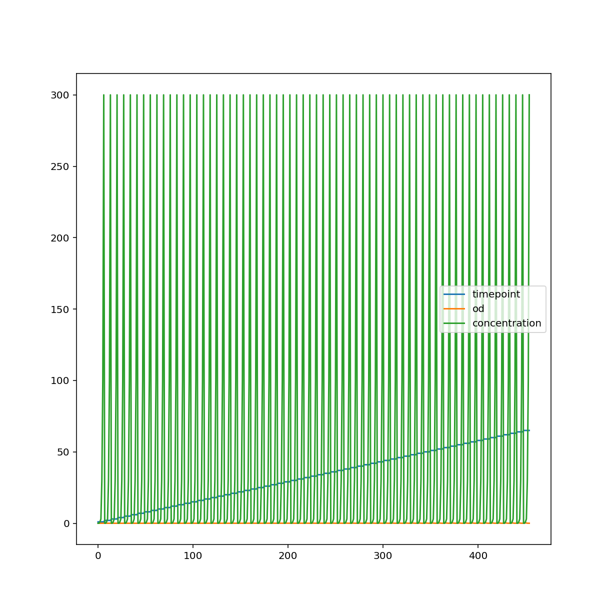

We can specify a different kind of plot, choosing columns explicitly.

~~~
growth.plot.scatter("timepoint", "od")
~~~
{: .language-python}

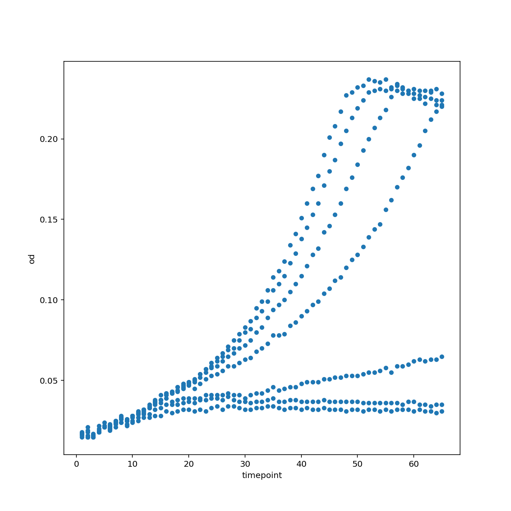

Other types of plots include a histogram. You can also see that we use matplotlib
directly in order to customize the plot further.

~~~
growth["concentration"].plot.hist(bins=30)
~~~
{: .language-python}

~~~
<AxesSubplot:ylabel='Frequency'>
~~~
{: .output}

~~~
plt.xlabel("concentration")
~~~
{: .language-python}

~~~
Text(0.5, 0, 'concentration')
~~~
{: .output}

~~~
plt.show()
~~~
{: .language-python}

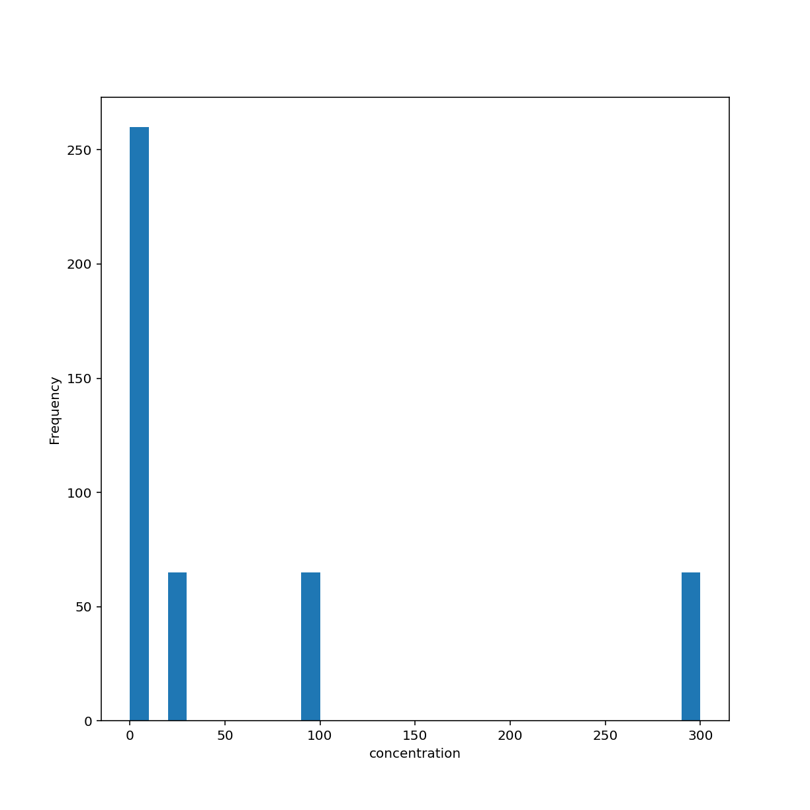

Another type of plot for showing distributions is the box plot which, again, by default uses numeric columns.

~~~
growth.plot.box()
~~~
{: .language-python}

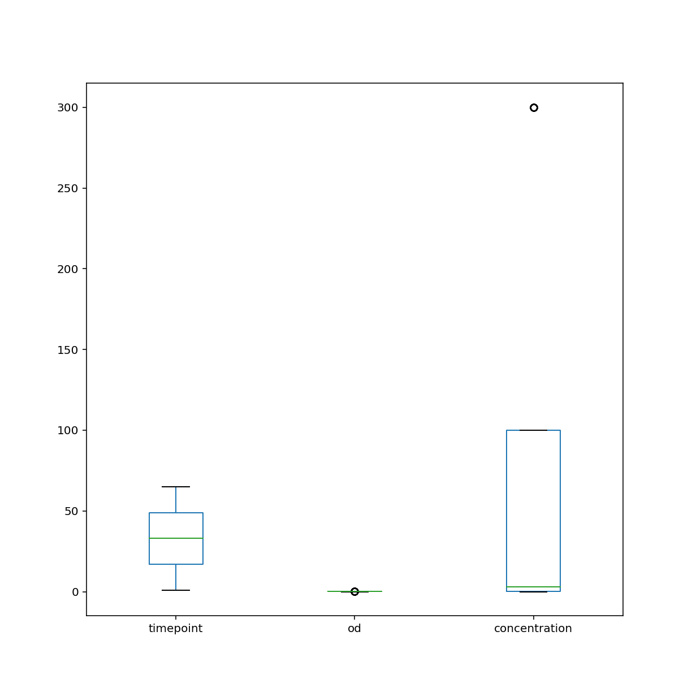

My opinion on native Pandas plotting:

  * Great for quick visualization
  * Unlike base matplotlib, can refer to data by column name
  * Selecting data using Pandas indexing is awesome
  * Customizing figures with matplotlib commands can be tedious
  * Adding trend lines, regression plots, managing colors can become a pain in the neck

## State of plotting in Python

<https://pyviz.org/overviews/index.html>

* Overwhelming number of options
* Why we chose [altair](https://altair-viz.github.io/index.html) for this workshop:
  * It based on [Vega-Lite](https://vega.github.io/vega-lite/)'s visualization grammar
  * [Vega](http://vega.github.io/vega) in turn is based on [D3.js](https://d3js.org/) thus it natively works in your browser and provides interactivity
  * Main authors Jake Vanderplas and Brian Granger are well known figures in the
    Python visualization space and as academics can be expected to keep maintaining the project
    
## Grammar of Graphics

The [grammar of graphics](https://www.springer.com/gp/book/9780387245447) was described by Leland Wilkinson. It was later [updated by Hadley Wickham](https://www.tandfonline.com/doi/abs/10.1198/jcgs.2009.07098) with ideas developed during the creation of his famous `R` plotting software `ggplot2`.
[This blog has a decent summary of both.](https://towardsdatascience.com/a-comprehensive-guide-to-the-grammar-of-graphics-for-effective-visualization-of-multi-dimensional-1f92b4ed4149)
In lose terms, the idea is that every visualization has the following ingredients:

* data (ideally in a tidy format)
* a coordinate system to draw in the data
* visual marks (geometries) that represent the data
* aesthetics that describe which data encode visual properties

This all sounds a bit abstract. Let's dive into examples.

## Introduction to altair

We need the altair package, of course.

~~~
import altair as alt
width = 800
height = 600
~~~
{: .language-python}

Here we create an altair
`Chart` object with our tidy growth data frame. The default coordinate system is Cartesian with two axes. We encode our data and specify that
the time points should describe our x-axis coordinate and optical density the y-axis coordinate. Finally,
we want this two-dimensional data to be displayed by the visual mark _points_.

The default output size is a bit small in my opinion so we configure it to be a bit larger.

~~~
alt.Chart(growth).encode(
    x="timepoint", y="od"
).mark_point().configure_view(continuousWidth=width, continuousHeight=height)
~~~
{: .language-python}

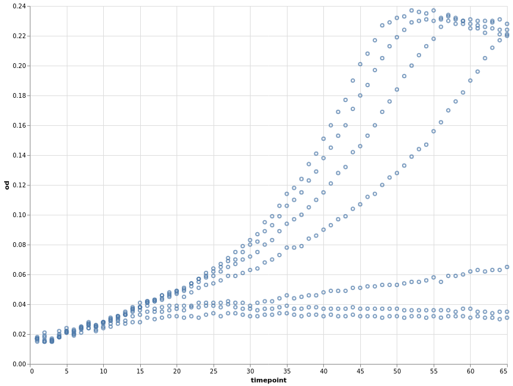

We can, at any point, store our current chart specification in a variable and later
apply further specifications to it.

~~~
base = alt.Chart(growth).encode(x="timepoint", y="od")
~~~
{: .language-python}

How about using lines as the visual mark?

~~~
base.mark_line().configure_view(continuousWidth=width, continuousHeight=height)
~~~
{: .language-python}

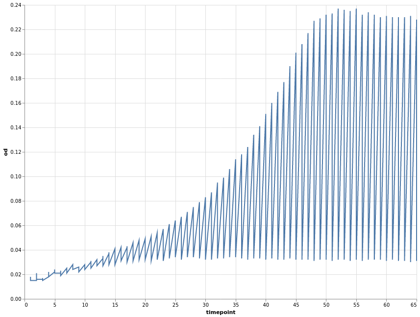

The above plot has the same problems as the Pandas default plot. Our data was recorded per _well_. We can use this variable to encode a third dimension that
groups our data. Common options are colour or shape/linetype.

~~~
base.encode(color="well").mark_line(point=True).configure_view(
    continuousWidth=width, continuousHeight=height
)
~~~
{: .language-python}

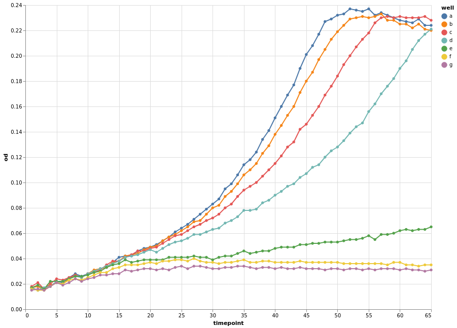

This looks much better already. We also changed the visual mark to be a point and line.

Instead of defining separate groups for each growth time course, we can separate
each individual time course into its own plot. This is known as facetting. Using
facets can be handy but information is more spread out. Comparing different time
courses is harder in this format.

~~~
base.mark_line(point=True).facet("well", columns=3)
~~~
{: .language-python}

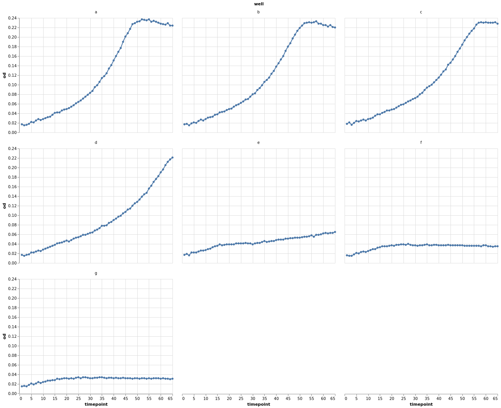

Let's look again at the individual data points grouped by _well_.

~~~
chart = alt.Chart(growth).encode(x="timepoint", y="od", color="well").mark_point()
chart.configure_view(continuousWidth=width, continuousHeight=height)
~~~
{: .language-python}

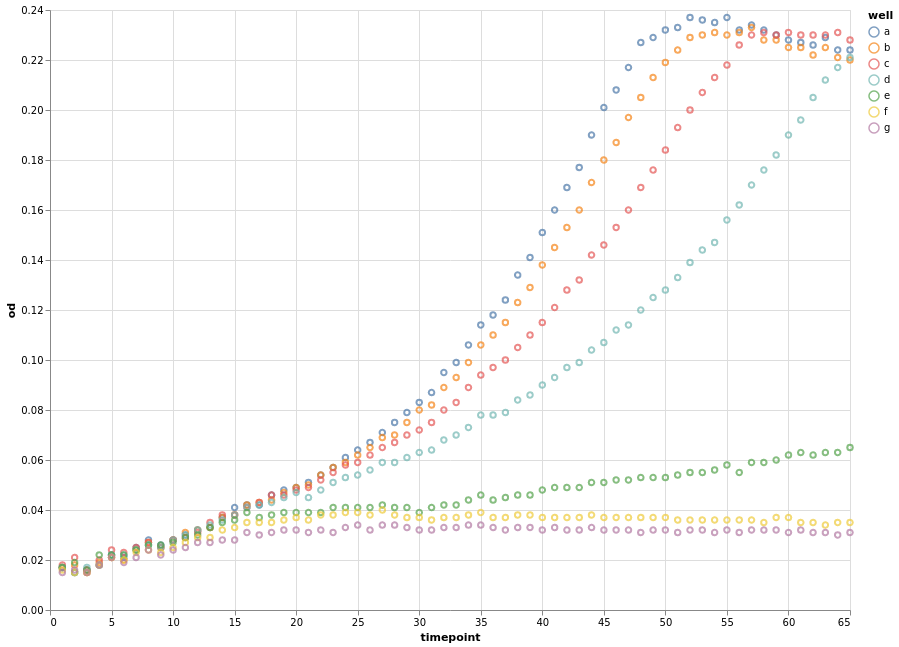

Instead of connecting each consecutive data point with a straight line, we can
apply a smoothing data transformation. In the following example, we use a
[locally estimated scatterplot smoothing (LOESS)](https://en.wikipedia.org/wiki/Local_regression) transformation.

~~~
(
    chart
    + chart.transform_loess(
        "timepoint", "od", groupby=["well"], bandwidth=0.15
    ).mark_line()
).configure_view(continuousWidth=width, continuousHeight=height)
~~~
{: .language-python}

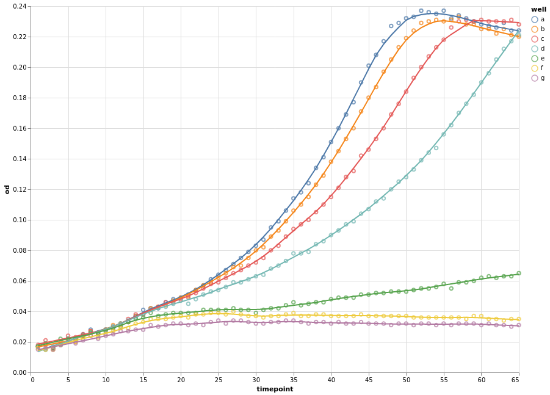

We can now combine the concepts that we have learnt to introduce a fourth dimension,
the measured concentration. Since the concentration is a measured quantity, we
use a continuous colour scale to represent it. We still group our data by wells
and apply smoothing. As an example, we vary the point shape.

Please not that for the first time we explicitly encode the type of the variables.
`Q` means quantitative (continuous) and `N` means nominal (categorical).

~~~
fancy_chart = alt.Chart(growth).encode(
    x="timepoint:Q",
    y="od:Q",
    detail="well:N",
    color=alt.Color("concentration:Q", scale=alt.Scale(type="log", scheme="greenblue")),
)
(
    fancy_chart.transform_loess(
        "timepoint", "od", groupby=["well", "concentration"], bandwidth=0.1
    ).mark_line()
    + fancy_chart.encode(shape="well:N").mark_point()
).configure_view(continuousWidth=width, continuousHeight=height)
~~~
{: .language-python}

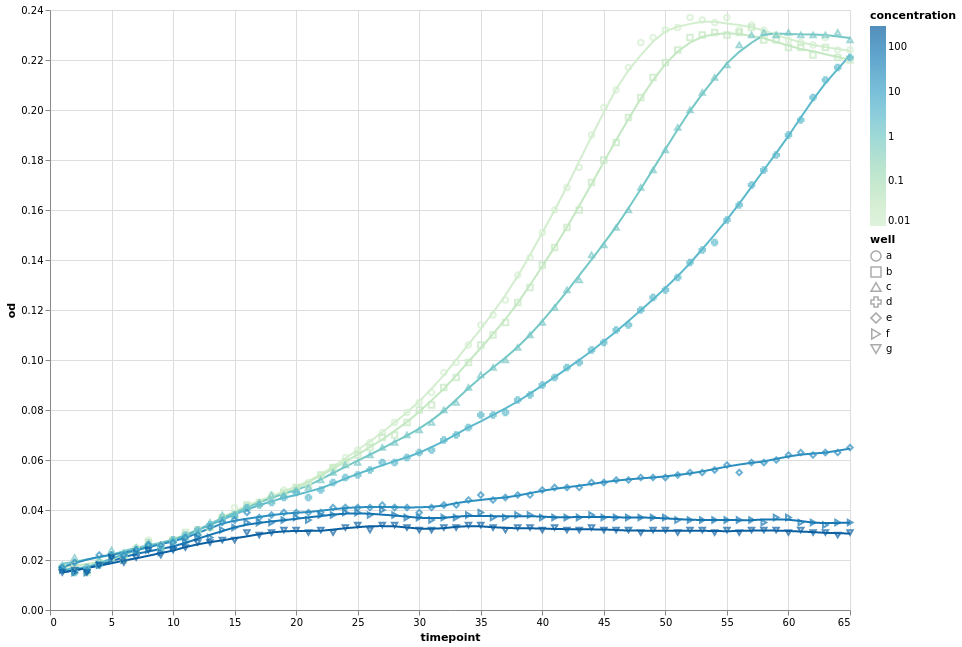

## Other visual marks

Naturally, altair offers more than just lines and points.

An interactive histogram:

~~~
brush = alt.selection_interval(encodings=["x"])

base = (
    alt.Chart(growth).mark_bar().encode(y="count():Q").properties(width=600, height=100)
)

alt.vconcat(
    base.encode(
        alt.X(
            "od:Q", bin=alt.Bin(maxbins=30, extent=brush), scale=alt.Scale(domain=brush)
        )
    ),
    base.encode(
        alt.X("od:Q", bin=alt.Bin(maxbins=30)),
    ).add_selection(brush),
)
~~~
{: .language-python}

Or how about boxplot of optical density per well.

~~~
alt.Chart(growth).mark_boxplot().encode(x="well:O", y="od:Q").configure_view(continuousWidth=width, continuousHeight=height)
~~~
{: .language-python}

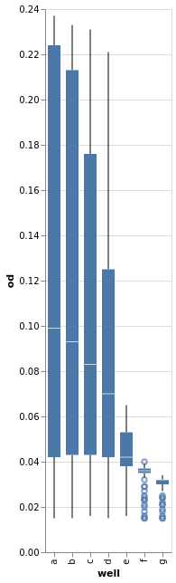

Many more [examples](https://altair-viz.github.io/gallery/index.html) exist.
