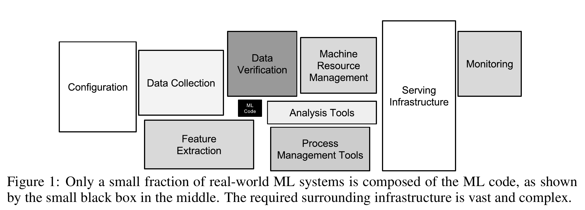
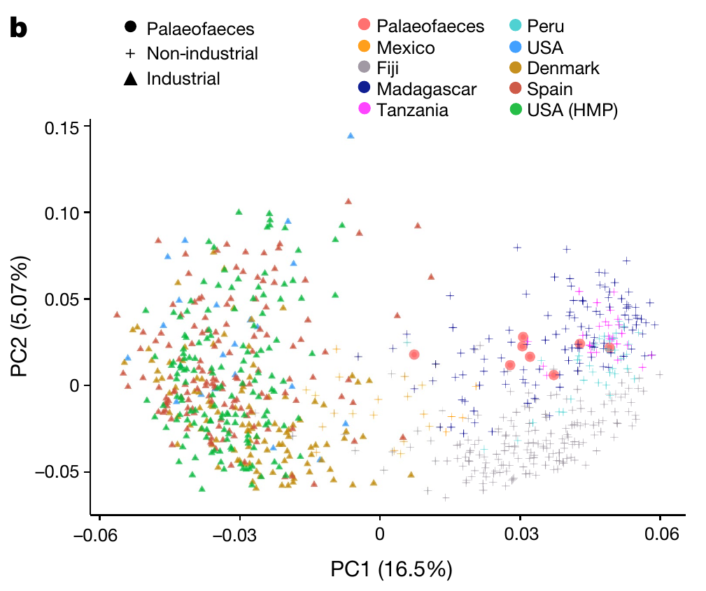
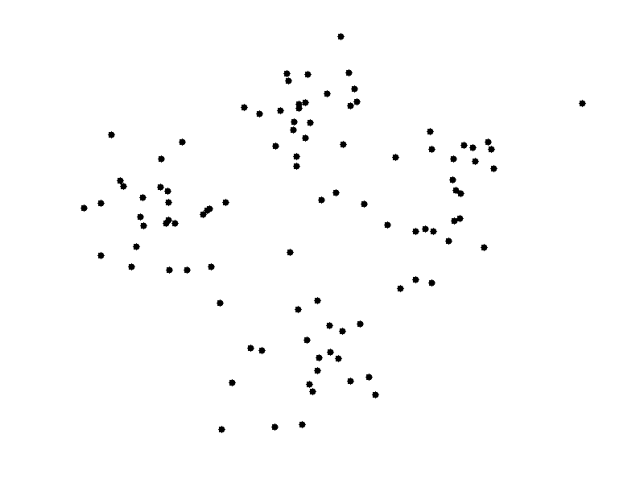
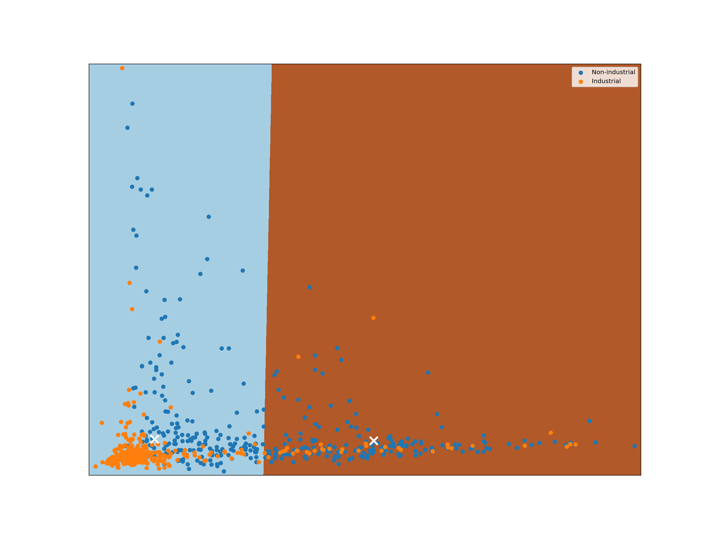
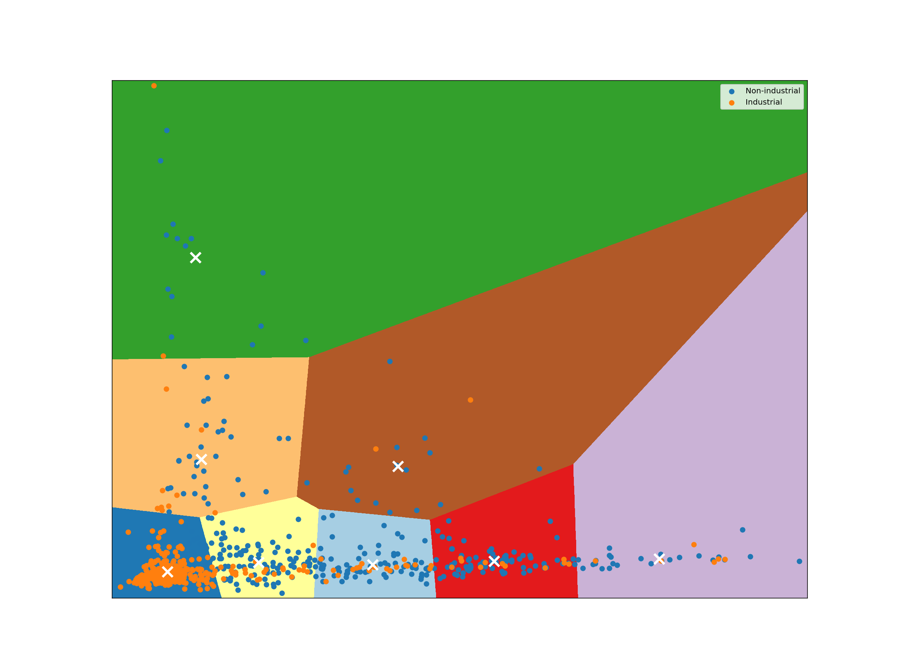
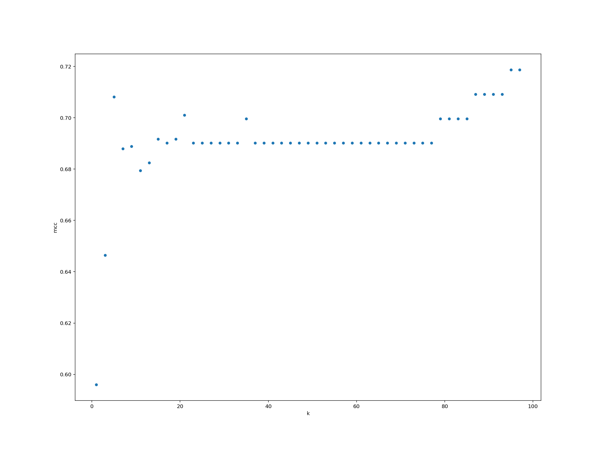
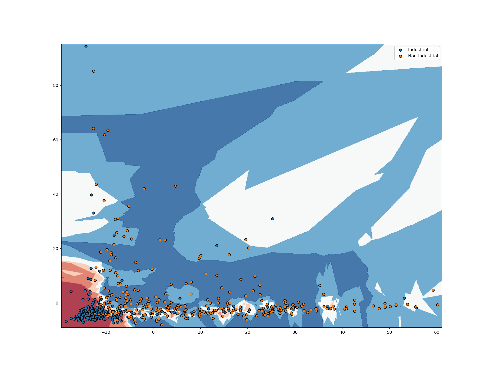
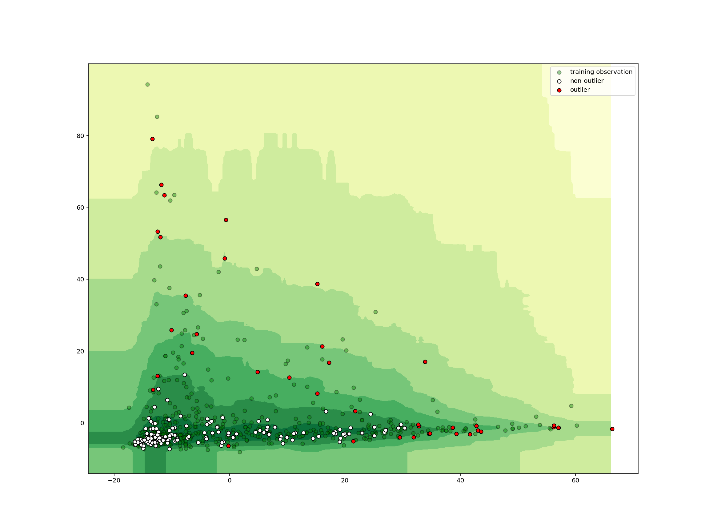
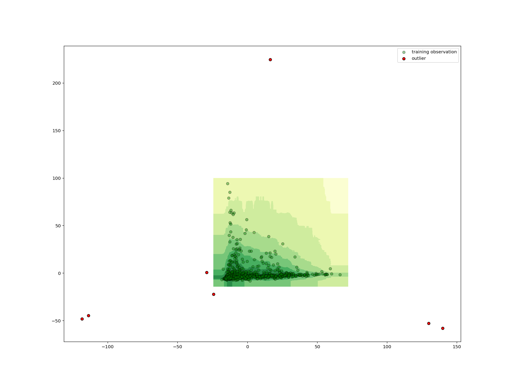

---
# Please do not edit this file directly; it is auto generated.
# Instead, please edit 03-machine-learning.md in _episodes_rmd/
title: "Machine Learning"
teaching: 35
exercises: 0
questions:
  - "What is this magic?"
objectives:
  - "Get an introduction scikit-learn."
keypoints:
  - "Classification."
---

> ## Episode Credit
>
> This episode is adapted and enhanced from <https://github.com/YaleDHLab/lab-workshops/tree/master/machine-learning>.
{: .callout}

As a real-world dataset for practicing machine learning tasks on, we will use relative abundances of gut microbiota. In a brand new publication

> Wibowo, Marsha C., Zhen Yang, Maxime Borry, Alexander Hübner, Kun D. Huang, Braden T. Tierney, Samuel Zimmerman, et al. 2021. “Reconstruction of Ancient Microbial Genomes from the Human Gut.” Nature, May. https://doi.org/10.1038/s41586-021-03532-0.

modern industrial and pre-industrial fecal microbiota were compared to some ancient samples (palaeofaeces).

## ETL relative microbial abundances

~~~
import pandas as pd
~~~
{: .language-python}

While the following command is running, [take a look at the spreadsheet](data/41586_2021_3532_MOESM6_ESM.xlsx) itself.

~~~
raw = pd.read_excel(
    "data/41586_2021_3532_MOESM6_ESM.xlsx",
    sheet_name="Tab1-MetaPhlAn2_output",
    header=None,
)
~~~
{: .language-python}

What did we extract from the spreadsheet?

~~~
raw.head(10)
~~~
{: .language-python}

~~~
                                                 0           1    ...       799       800
0                                                NaN  Paleofeces  ...      Soil      Soil
1                                                NaN      UT43.2  ...  1043.4.1  3567.1.1
2                                         k__Archaea     7.18607  ...         0    0.0049
3                        k__Archaea|p__Euryarchaeota     7.18607  ...         0    0.0049
4        k__Archaea|p__Euryarchaeota|c__Archaeoglobi           0  ...         0         0
5  k__Archaea|p__Euryarchaeota|c__Archaeoglobi|o_...           0  ...         0         0
6  k__Archaea|p__Euryarchaeota|c__Archaeoglobi|o_...           0  ...         0         0
7  k__Archaea|p__Euryarchaeota|c__Archaeoglobi|o_...           0  ...         0         0
8        k__Archaea|p__Euryarchaeota|c__Halobacteria           0  ...         0         0
9  k__Archaea|p__Euryarchaeota|c__Halobacteria|o_...           0  ...         0         0

[10 rows x 801 columns]
~~~
{: .output}

This is the output from a particular software (MetaPhlAn2) for estimating microbial abundances from metagenomic sequencing (MGS) data. The single letter with double underscore prefix in the first column denotes the taxonomic rank. Multiple ranks
are divided by `|` and describe a lineage.

The first two rows in the table describe the type of sample and a sample identifier.

~~~
raw.info()
~~~
{: .language-python}

~~~
<class 'pandas.core.frame.DataFrame'>
RangeIndex: 3636 entries, 0 to 3635
Columns: 801 entries, 0 to 800
dtypes: object(801)
memory usage: 22.2+ MB
~~~
{: .output}

Due to the sample identifiers in every column, they are all of type `object` rather than numerical.

Let's make this tidy!

### Tidying up

#### Sample meta information

We will split the information that describes the samples. We will also get to know
another Pandas feature, the [pipe](https://pandas.pydata.org/pandas-docs/stable/reference/api/pandas.DataFrame.pipe.html) which allows us to chain function calls. In order to make full use of the chaining, we also need a function to assign values to the data frame.

~~~
def set_element(df, row_idx, col_idx, value):
    result = df.copy()
    result.iat[row_idx, col_idx] = value
    return result
~~~
{: .language-python}

Our meta information is in the first two rows. We then set meaningful names in
the currently empty fields. Next we set the first column as the row index. Then
we transpose the table such that our two rows become two columns and reset the
index of that transposed data frame such that we end up with a range index starting
at zero.

~~~
observations = (
    raw.iloc[:2, :]
    .pipe(set_element, 0, 0, "label")
    .pipe(set_element, 1, 0, "sample")
    .set_index(0)
    .T.reset_index(drop=True)
)
~~~
{: .language-python}

The result looks as follows:

~~~
observations.head(10)
~~~
{: .language-python}

~~~
0           label   sample
0      Paleofeces   UT43.2
1      Paleofeces    AW107
2      Paleofeces    AW108
3      Paleofeces   AW110A
4      Paleofeces    Zape1
5      Paleofeces    Zape2
6      Paleofeces    Zape3
7      Paleofeces   UT30.3
8  Non-industrial  MEX3158
9  Non-industrial  MEX3160
~~~
{: .output}

> ## Inspect the observations
>
> Can you confirm that we haven't lost any samples? Additionally, is there something
> interesting to be said about the data?
>
> > ## Solution
> >
> > 
> > ~~~
> > observations.shape
> > ~~~
> > {: .language-python}
> > 
> > 
> > 
> > ~~~
> > (800, 2)
> > ~~~
> > {: .output}
> > The observations have the same dimension as the relative abundances.
> > 
> > 
> > ~~~
> > observations.describe()
> > ~~~
> > {: .language-python}
> > 
> > 
> > 
> > ~~~
> > 0            label  sample
> > count          800     800
> > unique           4     800
> > top     Industrial  MH0397
> > freq           418       1
> > ~~~
> > {: .output}
> > 
> > We see that there are four unique labels and that the label 'Industrial' is the most common.
> > 
> > 
> > ~~~
> > observations["label"].value_counts()
> > ~~~
> > {: .language-python}
> > 
> > 
> > 
> > ~~~
> > Industrial        418
> > Non-industrial    371
> > Paleofeces          8
> > Soil                3
> > Name: label, dtype: int64
> > ~~~
> > {: .output}
> > 
> > An overview on the number of samples per label.
> > 
> {: .solution}
{: .challenge}

Now that we have the sample meta information in a tidy format, it is time that
we clean up the relative abundances.

#### Relative abundances

There is a lot of information contained in the first column. Let's split this
information into multiple columns. The taxonomic rank deserves its own column so
that we can later filter on it. For convenience, we also keep the kingdom of every sample for later data filtering.

Our strategy is then:

* Split the strings in the first column on `|`
* The first element in the resulting list is the highest taxonomic rank, i.e., kingdom
* The last element in the list is the lowest taxonomic rank, this will be anything from kingdom down to strain level
* We remove the rank prefix to end up with nice names

~~~
def transform_taxonomic_rank(df):
    result = df.rename(columns={0: "taxonomy"})
    lineage = result["taxonomy"].str.split("|")
    result["kingdom"] = (
        lineage.map(lambda element: element[0])
        .str.split("__", n=1, expand=True)
        .iloc[:, -1]
    )
    result[["rank", "taxonomy"]] = lineage.map(lambda element: element[-1]).str.split(
        "__", n=1, expand=True
    )
    return result
~~~
{: .language-python}

~~~
transformed = transform_taxonomic_rank(raw.iloc[2:, :])
~~~
{: .language-python}

Let's see what our result looks like.

> ## Inspect the transformed data frame
>
> Briefly investigate the transformed data frame.
>
> > ## Solution
> >
> > 
> > ~~~
> > transformed.head(10)
> > ~~~
> > {: .language-python}
> > 
> > 
> > 
> > ~~~
> >                          taxonomy        1        2        3  ... 799     800  kingdom rank
> > 2                         Archaea  7.18607  3.52607  0.10627  ...   0  0.0049  Archaea    k
> > 3                   Euryarchaeota  7.18607  3.52607  0.10627  ...   0  0.0049  Archaea    p
> > 4                    Archaeoglobi        0        0        0  ...   0       0  Archaea    c
> > 5                 Archaeoglobales        0        0        0  ...   0       0  Archaea    o
> > 6                Archaeoglobaceae        0        0        0  ...   0       0  Archaea    f
> > 7   Archaeoglobaceae_unclassified        0        0        0  ...   0       0  Archaea    g
> > 8                    Halobacteria        0        0        0  ...   0       0  Archaea    c
> > 9                 Halobacteriales        0        0        0  ...   0       0  Archaea    o
> > 10               Halobacteriaceae        0        0        0  ...   0       0  Archaea    f
> > 11                  Halobacterium        0        0        0  ...   0       0  Archaea    g
> > 
> > [10 rows x 803 columns]
> > ~~~
> > {: .output}
> > 
> > 
> > ~~~
> > transformed.info()
> > ~~~
> > {: .language-python}
> > 
> > 
> > 
> > ~~~
> > <class 'pandas.core.frame.DataFrame'>
> > RangeIndex: 3634 entries, 2 to 3635
> > Columns: 803 entries, taxonomy to rank
> > dtypes: object(803)
> > memory usage: 22.3+ MB
> > ~~~
> > {: .output}
> > 
> > 
> > ~~~
> > transformed.describe()
> > ~~~
> > {: .language-python}
> > 
> > 
> > 
> > ~~~
> >               taxonomy       1       2       3  ...     799     800   kingdom  rank
> > count             3633  3634.0  3634.0  3634.0  ...  3634.0  3634.0      3633  3634
> > unique            3527   150.0   134.0   132.0  ...   123.0   292.0         4     9
> > top     Viruses_noname     0.0     0.0     0.0  ...     0.0     0.0  Bacteria     s
> > freq                 5  3312.0  3349.0  3342.0  ...  3399.0  3056.0      3020  1459
> > 
> > [4 rows x 803 columns]
> > ~~~
> > {: .output}
> > 
> > 
> > ~~~
> > transformed["kingdom"].value_counts()
> > ~~~
> > {: .language-python}
> > 
> > 
> > 
> > ~~~
> > Bacteria     3020
> > Viruses       479
> > Eukaryota      91
> > Archaea        43
> > Name: kingdom, dtype: int64
> > ~~~
> > {: .output}
> > 
> > 
> > ~~~
> > transformed["rank"].value_counts()
> > ~~~
> > {: .language-python}
> > 
> > 
> > 
> > ~~~
> > s               1459
> > t               1267
> > g                503
> > f                216
> > o                 98
> > c                 58
> > p                 28
> > k                  4
> > unclassified       1
> > Name: rank, dtype: int64
> > ~~~
> > {: .output}
> > 
> {: .solution}
{: .challenge}

From our inspection of the data, we decide that it's best to remove the abundance of unclassified sequencing reads. In addition, I don't trust the read assignment to virus genomes and they don't play a large role. We remove those as well.

Similarly to before, we then set the new columns as the row index, then we convert all abundances from `object` types to `float` types, transpose the data frame, and reset the index again for a nice range starting from zero.

~~~
abundance = (
    transformed.query("kingdom != 'Viruses' and rank != 'unclassified'")
    .set_index(["kingdom", "rank", "taxonomy"])
    .astype(float)
    .T.reset_index(drop=True)
)
~~~
{: .language-python}

We have chosen three columns as the index here. That means, we are creating an
index with multiple levels (a [`pandas.MultiIndex`](https://pandas.pydata.org/pandas-docs/stable/user_guide/advanced.html)). Multi indeces can be tricky to work with. We will just use them here
but do not expect a full understanding.

~~~
abundance.head(10)
~~~
{: .language-python}

~~~
kingdom   Archaea                ...               Eukaryota              
rank            k             p  ...                       s             t
taxonomy  Archaea Euryarchaeota  ... Enterocytozoon_bieneusi GCA_000209485
0         7.18607       7.18607  ...                     0.0           0.0
1         3.52607       3.52607  ...                     0.0           0.0
2         0.10627       0.10627  ...                     0.0           0.0
3         0.32794       0.32794  ...                     0.0           0.0
4         0.52044       0.52044  ...                     0.0           0.0
5         0.02790       0.02790  ...                     0.0           0.0
6         0.03779       0.03779  ...                     0.0           0.0
7         2.80318       2.80318  ...                     0.0           0.0
8         0.00000       0.00000  ...                     0.0           0.0
9         0.00000       0.00000  ...                     0.0           0.0

[10 rows x 3154 columns]
~~~
{: .output}

Relative abundances are percentage numbers of the counts. They apply to each taxonomic rank so that adding up the relative abundances per rank should be
close to 100%. It may be lower since we removed viruses and unclassified reads.

~~~
import numpy as np
~~~
{: .language-python}

We can create a basic sanity check based on above ideas. For each rank individually,
the relative abundance should sum up to (maximally) 100 in every sample.

~~~
for rank in abundance.columns.unique(level="rank"):
    view = abundance.loc[:, abundance.columns.get_loc_level(rank, level="rank")[0]]
    total = view.sum(axis=1)
    assert ((total < 100.0) | np.isclose(total, 100.0)).all()
~~~
{: .language-python}

How many variables (columns, features) do we actually have per rank?

~~~
for rank in abundance.columns.unique(level="rank"):
    print(rank, abundance.columns.get_loc_level(rank, level="rank")[0].sum())
~~~
{: .language-python}

~~~
k 3
p 27
c 57
o 92
f 184
g 443
s 1265
t 1083
~~~
{: .output}

Since we have the most variables at the species level and because I wouldn't outright trust MGS' ability to distinguish strains, we will use the species level for our machine learning tasks. We can always go to a higher taxonomic rank to test performance on more aggregate signals.

~~~
species_abundance = abundance.loc[
    :, abundance.columns.get_loc_level("s", level="rank")[0]
].copy()
~~~
{: .language-python}

~~~
species_abundance.shape
~~~
{: .language-python}

~~~
(800, 1265)
~~~
{: .output}

This was a lot of work, you may think, and we haven't even done any machine learning yet! You are completely right about that feeling. According to a white paper by Google engineers, creating machine learning models is a tiny fraction of the work.

<figcaption>

Image taken from a <a href="https://papers.nips.cc/paper/5656-hidden-technical-debt-in-machine-learning-systems.pdf">NIPS conference paper</a>.

</figcaption>

## Introduction to Machine Learning

Andrew Ng, a prominent machine learning expert, has defined machine learning as "the science of getting computers to act without being explicitly programmed." This workshop is meant to give a quick introduction to some of the techniques one can use to build algorithms that meet this criterion. Specifically, we will discuss the following sub-fields within machine learning:

 * **Dimensionality Reduction** (for analyzing and visualizing high-dimensional data sets)
 * **Clustering** (for grouping similar objects in a high dimensional space)
 * **Classification** (for using labeled data to infer labels for unlabeled data)
 * **Anomaly Detection** (for finding outliers in a data set)
 
Let's dive in!

## Dimensionality Reduction

Our relative abundances data set at the species level has a large number of variables (features in machine learning lingo). We have 1265 features and only 800 samples. Microbiome data are often also quite sparse that means most species are only observed in a small number of samples.

Such "high-dimensional" data sets can be quite hard to work with and reason about, not to mention impossible to visualize. High-dimensional data also pose specific challenges to many machine learning models (see [The Curse of Dimensionality](https://en.wikipedia.org/wiki/Curse_of_dimensionality)). To work around these challenges, it's often helpful to reduce the number of dimensions required to express a given data set.

One popular way to reduce the dimensionality of a data set is to use a technique called [**Principal Component Analysis**](https://en.wikipedia.org/wiki/Principal_component_analysis). PCA tries to find a lower dimensional representation of data points by projecting them down into a smaller dimensional space in a way that minimizes loss of information.

To get an intuition about PCA, suppose you have points in two dimensions, and you wish to reduce the dimensionality of your data set to a single dimension. To do so, you could find the center of the points then create a line $L$ with a random orientation that passes through that center. One can then project each point onto $L$ such that an imaginary line between the point and $L$ forms a right angle. Within this "projection", each 2D point can be represented by just its position along the 1D line $L$, effectively giving us a 1D representation of the point's position in its original space. Furthermore, we can use the difference between the largest and smallest values of points projected onto $L$ as a measure of the amount of "variance" or "spread" within the data captured by $L$. The greater this spread, the greater the amount of "signal" from the original data set is represented in the projection.

If one were to slowly rotate $L$ and continue measuring the difference between the greatest and smallest values on $L$ at each orientation, one could find the orientation of the projection line that minimizes information loss (maximizes spread). This line of minimal information loss is shown in pink below. Once that line is discovered, we can project all of our points onto that lower-dimensional embedding. See the red points below when the black line is colinear with the pink line:

<figcaption>

For a beginner-friendly deep dive into the mechanics behind this form of dimensionality reduction, check out Josh Starmer's [step-by-step guide to PCA](https://www.youtube.com/watch?v=FgakZw6K1QQ).

</figcaption>

What makes this kind of dimensionality reduction useful for research? There are two primary uses: (visual) data exploration and data analysis.

### Exploratory data visualization with UMAP

Uniform Manifold Approximation and Projection (UMAP) is a dimension reduction technique that can be used for visualization but also for general non-linear dimension reduction. The author Leland McInnes has a recorded [presentation](https://www.youtube.com/watch?v=nq6iPZVUxZU) about how the method works in detail.

UMAP considers the distances between samples in a particular space (the manifold)
and projects those distances to a Cartesian coordinate system with typically two dimensions. That means we need to transform our relative abundances into a square
distance matrix that contains the pairwise distance between every sample.

In microbiome analyses, a common metric to compare samples is the [Bray-Curtis dissimilarity](https://en.wikipedia.org/wiki/Bray%E2%80%93Curtis_dissimilarity). It is a $\beta$-diversity measure since we can use it to compare samples from different
ecological niches. We use scikit-bio for a fast implementation of this measure.

~~~
from skbio.diversity import beta_diversity
~~~
{: .language-python}

~~~
bc_dm = beta_diversity(
    metric="braycurtis", counts=species_abundance, ids=observations["sample"]
)
~~~
{: .language-python}

~~~
print(bc_dm)
~~~
{: .language-python}

~~~
800x800 distance matrix
IDs:
'UT43.2', 'AW107', 'AW108', 'AW110A', 'Zape1', 'Zape2', 'Zape3', 'UT30.3', ...
Data:
[[0.         0.75103997 0.81117371 ... 0.97354678 0.98426476 0.95241561]
 [0.75103997 0.         0.50414618 ... 0.99686836 0.99895874 0.96373897]
 [0.81117371 0.50414618 0.         ... 0.9969896  0.99919453 0.97885096]
 ...
 [0.97354678 0.99686836 0.9969896  ... 0.         0.8080406  0.59635894]
 [0.98426476 0.99895874 0.99919453 ... 0.8080406  0.         0.6525434 ]
 [0.95241561 0.96373897 0.97885096 ... 0.59635894 0.6525434  0.        ]]
~~~
{: .output}

Now we are ready to create a lower dimensional projection of this distance matrix.

We would like to take this opportunity to introduce a cool (and in this case useful) feature of Jupyter: interactivity. In order to make the interactivity work as intended, we will define a few functions. One for the UMAP, another to plot the result, and a third to handle the interactivity.

~~~
from umap import UMAP
~~~
{: .language-python}

~~~
def get_umap_embedding(num):
    """Create a particular projection using a given number of neighbours."""
    result = pd.DataFrame(
        data=UMAP(
            n_neighbors=num, random_state=123456, metric="precomputed", n_components=2
        ).fit_transform(bc_dm.data.copy()),
        columns=["D1", "D2"],
        index=observations.index,
    )
    result[["label", "sample"]] = observations[["label", "sample"]].copy()
    return result
~~~
{: .language-python}

~~~
import altair as alt
~~~
{: .language-python}

~~~
def plot_umap(df, num):
    """Create an interactive altair chart from a UMAP result."""
    selection = alt.selection_multi(fields=["label"])
    color = alt.condition(
        selection,
        alt.Color("label:N", scale=alt.Scale(scheme="set1"), legend=None),
        alt.value("lightgray"),
    )
    shape = alt.Shape("label", legend=None)

    scatter = (
        alt.Chart(df, title=f"Number of Neighbours = {num}")
        .encode(
            x="D1", y="D2", color=color, shape=shape, tooltip=["sample:N", "label:N"]
        )
        .mark_point(filled=True)
        .interactive()
    )

    legend = (
        alt.Chart(df)
        .encode(
            y=alt.Y("label:N", axis=alt.Axis(orient="right")), color=color, shape=shape
        )
        .mark_point()
        .add_selection(selection)
    )

    return (scatter | legend).configure_view(continuousWidth=800, continuousHeight=600)
~~~
{: .language-python}

~~~
from functools import lru_cache
~~~
{: .language-python}

~~~
@lru_cache()
def run_umap(num: int):
    embedding = get_umap_embedding(num)
    return plot_umap(embedding, num)
~~~
{: .language-python}

~~~
from ipywidgets import interact, widgets
~~~
{: .language-python}

In order to avoid expensive recalculation of results when moving the slider to
previous numbers, we use caching.

~~~
interact(run_umap, num=widgets.IntSlider(min=5, max=95, step=10, value=15))
~~~
{: .language-python}

The number of neighbours considered is an important parameter for UMAP. Nonetheless, the global structures look very similar. Compare the results to the PCA plot from the paper.

There are very few palaeofaeces and soil samples. We exclude both from further machine learning tasks.

~~~
industrial_vs_non_obs = observations[
    observations["label"].isin(["Industrial", "Non-industrial"])
].reset_index(drop=True)
~~~
{: .language-python}

~~~
industrial_vs_non_obs.shape
~~~
{: .language-python}

~~~
(789, 2)
~~~
{: .output}

~~~
industrial_vs_non_abn = species_abundance.loc[
    industrial_vs_non_obs.index, :
].reset_index(drop=True)
~~~
{: .language-python}

~~~
industrial_vs_non_abn.shape
~~~
{: .language-python}

~~~
(789, 1265)
~~~
{: .output}

## Clustering

Clustering is a powerful machine learning technique and one that often requires some kind of distance metric. The goal of a clustering algorithm is to create some groups of observations, where each group contains similar observations.

There are a variety of methods for clustering vectors, including [density-based clustering](https://en.wikipedia.org/wiki/DBSCAN), [hierarchical clustering](https://en.wikipedia.org/wiki/Hierarchical_clustering), and [centroid clustering](https://en.wikipedia.org/wiki/Cluster_analysis). One of the most intuitive and most commonly used centroid-based methods is [K-Means Clustering](https://en.wikipedia.org/wiki/K-means_clustering).

Given a collection of points in a space, K-Means selects *K* "centroid" points randomly (colored green below), then assigns each non-centroid point to the centroid to which it's closest. Using these preliminary groupings, the next step is to find the geometric center of each group, using the same technique one would use to find the center of a square. These group centers become the new centroids, and again each point is assigned to the centroid to which it's closest. This process continues until centroid movement falls below some minimal movement threshold, after which the clustering is complete.

As discussed before, we use PCA to reduce the number of dimensions in our data
to two.

~~~
from sklearn.decomposition import PCA
~~~
{: .language-python}

~~~
pca = PCA(n_components=2).fit(industrial_vs_non_abn)
pca.explained_variance_ratio_
~~~
{: .language-python}

~~~
array([0.26181605, 0.1059267 ])
~~~
{: .output}

~~~
reduced_species = pca.transform(industrial_vs_non_abn)
~~~
{: .language-python}

~~~
from sklearn.cluster import KMeans
~~~
{: .language-python}

~~~
import matplotlib.pyplot as plt
plt.rcParams["figure.figsize"] = 16, 12
~~~
{: .language-python}

~~~
def plot_kmeans_clusters():
    # Step size of the mesh. Decrease to increase the quality of the VQ.
    h = 0.02  # point in the mesh [x_min, x_max]x[y_min, y_max].

    # Plot the decision boundary. For that, we will assign a color to each
    x_min, x_max = reduced_species[:, 0].min() - 1, reduced_species[:, 0].max() + 1
    y_min, y_max = reduced_species[:, 1].min() - 1, reduced_species[:, 1].max() + 1
    xx, yy = np.meshgrid(np.arange(x_min, x_max, h), np.arange(y_min, y_max, h))

    # Obtain labels for each point in mesh. Use last trained model.
    Z = kmeans.predict(np.c_[xx.ravel(), yy.ravel()])

    # Put the result into a color plot
    Z = Z.reshape(xx.shape)
    plt.figure(1)
    plt.clf()
    plt.imshow(
        Z,
        interpolation="nearest",
        extent=(xx.min(), xx.max(), yy.min(), yy.max()),
        cmap=plt.cm.Paired,
        aspect="auto",
        origin="lower",
    )

    for key, sub in industrial_vs_non_obs.groupby("label", as_index=False, sort=False):
        plt.scatter(
            reduced_species[sub.index, 0],
            reduced_species[sub.index, 1],
            label=key,
        )

    # Plot the centroids as a white X
    centroids = kmeans.cluster_centers_
    plt.scatter(
        centroids[:, 0],
        centroids[:, 1],
        marker="x",
        s=169,
        linewidths=3,
        color="w",
        zorder=10,
    )

    plt.xlim(x_min, x_max)
    plt.ylim(y_min, y_max)
    plt.xticks(())
    plt.yticks(())
    plt.legend()
    plt.show()
~~~
{: .language-python}

~~~
kmeans = KMeans(n_clusters=2, n_init=16, random_state=123456).fit(reduced_species)
~~~
{: .language-python}

~~~
plot_kmeans_clusters()
~~~
{: .language-python}

~~~
kmeans = KMeans(n_clusters=8, n_init=16, random_state=123456).fit(reduced_species)
~~~
{: .language-python}

~~~
plot_kmeans_clusters()
~~~
{: .language-python}

## Classification

The goal of a classification task is to predict whether a given observation in a data set possesses some particular property or attribute. To make these predictions, we measure the attributes of several labeled data observations, then compare unknown observations to those measurements.

In our data set we have microbiome samples labeled either as 'industrial' or 'non-industrial'. Scikit-learn can help us to split out data into a training set
and a testing set.

### K-Nearest neighbors classifiers

With a [$K$-nearest neighbors classifier](https://en.wikipedia.org/wiki/K-nearest_neighbors_algorithm), we start with a labeled data set. We then add new, unlabeled observations to the data. For each, we consult the $K$ labeled observations to which the unlabeled observation is closest, where $K$ is an odd integer we use for all classifications. We then find the most common label among those $K$ observations (the "$K$-nearest neighbors") and give the new observation that label.

The following diagram shows this scenario. Our new observation (represented by the question mark) has some points near it that are labeled with a triangle or star. Suppose we have chosen to use 3 for our value of $K$. In that case, we consult the 3 nearest labeled points near the question mark. Those 3 nearest neighbors have labels: star, triangle, triangle. Using a majority vote, we give the question mark a triangle label.

Examining the plot above, we can see that if $K$ were set to 1, we would classify the question mark as a star, but if K is 3 or 5, we would classify the question mark as a triangle. That is to say, $K$ is an important parameter in a $K$-nearest neighbors classifier.

Let's see how we can use our labeled microbiome samples for classification.

With scikit-learn's convenience function, we split our data into a training set
and a test set. By default the size is approximately 3:1.

~~~
from sklearn.model_selection import train_test_split
~~~
{: .language-python}

~~~
train_abundance, test_abundance, train_label, test_label = train_test_split(
    reduced_species, industrial_vs_non_obs["label"]
)
~~~
{: .language-python}

~~~
np.unique(train_label, return_counts=True)
~~~
{: .language-python}

~~~
(array(['Industrial', 'Non-industrial'], dtype=object), array([319, 272]))
~~~
{: .output}

~~~
np.unique(test_label, return_counts=True)
~~~
{: .language-python}

~~~
(array(['Industrial', 'Non-industrial'], dtype=object), array([99, 99]))
~~~
{: .output}

~~~
from sklearn.neighbors import KNeighborsClassifier
from sklearn.metrics import matthews_corrcoef
~~~
{: .language-python}

~~~
@lru_cache
def run_knn(num):
    knn_clf = KNeighborsClassifier(num).fit(train_abundance, train_label)
    return matthews_corrcoef(test_label, knn_clf.predict(test_abundance))
~~~
{: .language-python}

~~~
interact(run_knn, num=widgets.IntSlider(min=1, max=9, step=2, value=3))
~~~
{: .language-python}

> ## Measure performance
>
> Can you systematically measure the classifier model performance (as measured by Matthews' correlation coefficient) for a wide range
> of $K$-values? Plot the results using any method that we have learnt.
>
> > ## Solution
> >
> > We create a data frame for storing the $K$-values and performance.
> >
> > 
> > ~~~
> > performance = pd.DataFrame({"k": list(range(1, 99, 2))})
> > ~~~
> > {: .language-python}
> > 
> > 
> > ~~~
> > performance["mcc"] = performance["k"].map(run_knn)
> > ~~~
> > {: .language-python}
> > 
> > 
> > ~~~
> > performance.plot.scatter("k", "mcc")
> > ~~~
> > {: .language-python}
> > 
> > 
> > 
> {: .solution}
{: .challenge}

For each observation we pass as input to `knn_clf.predict()`, the function returns a label (either 0 or 1). Just like that, we've trained a machine learning classifier and classified some test data!

The classification example above shows how we can classify just a single point in space, but suppose we want to analyze the way a classifier would classify each possible point in some space. To do so, we can transform our space into a grid of units, then classify each point in that grid. Analyzing a space in this way is known as identifying a classifier's [**decision boundary**](https://en.wikipedia.org/wiki/Decision_boundary), because this analysis shows one the boundaries between different classification outcomes in the space. This kind of analysis is very helpful in training machine learning models, because studying a classifier's decision boundary can help one see how to improve the classifier.

Let's take a look at the decision boundary of our classifier:

~~~
def plot_decision_boundary(clf, X, labels, h=0.1):
    # Plot the decision boundary. For that, we will assign a color to each
    # point in the mesh [x_min, x_max]x[y_min, y_max].
    x_min, x_max = X[:, 0].min() - 1, X[:, 0].max() + 1
    y_min, y_max = X[:, 1].min() - 1, X[:, 1].max() + 1
    xx, yy = np.meshgrid(np.arange(x_min, x_max, h), np.arange(y_min, y_max, h))
    Z = clf.predict_proba(np.c_[xx.ravel(), yy.ravel()])[:, 1]

    # Put the result into a color plot
    Z = Z.reshape(xx.shape)
    plt.contourf(xx, yy, Z, cmap=plt.cm.RdBu, alpha=0.8)

    # Plot also the training points
    for key, sub in labels.groupby("label", as_index=False, sort=False):
        plt.scatter(X[sub.index, 0], X[sub.index, 1], edgecolor="black", label=key)

    plt.legend(loc="best")
    plt.show()
~~~
{: .language-python}

~~~
knn_clf = KNeighborsClassifier(5).fit(train_abundance, train_label)
~~~
{: .language-python}

~~~
plot_decision_boundary(
    knn_clf,
    train_abundance,
    pd.DataFrame({"label": train_label}).reset_index(drop=True),
)
~~~
{: .language-python}

For each pixel in the plot above, we retrieve the $K$ closest points with known labels. We then use a majority vote of those labels to assign the label of the pixel. This is exactly analogous to predicting a label for an unlabeled point. In both cases, we take a majority vote of the $K$ closest points with known labels. Working in this way, we can use labeled data to classify unlabeled data. That's all there is to $K$-nearest neighbors classification!

It's worth noting that $K$-nearest neighbors is only one of many popular classification algorithms. From a high-level point of view, each classification algorithm works in a similar way. Each requires a certain number of observations with known labels and each uses those labeled observations to classify unlabeled observations. However, different classification algorithms use different logic to assign a label to new observations which means different classification algorithms have very different decision boundaries.

In the chart below, each row plots the decision boundaries several classifiers give the same data set. Notice how some classifiers work better with certain data shapes.

<figcaption>

<a href="https://scikit-learn.org/stable/auto_examples/classification/plot_classifier_comparison.html">Image credit</a>

</figcaption>

For an intuitive introduction to many of these classifiers, including Support Vector Machines, Decision Trees, Neural Networks, and Naive Bayes classifiers, see Luis Serrano's [introduction to machine learning video](https://www.youtube.com/watch?v=IpGxLWOIZy4) discussed in the [Going Further](#going-further) section below.

## Anomaly Detection

[Anomaly detection](https://en.wikipedia.org/wiki/Anomaly_detection) refers to the identification of anomalies, or outliers, in data sets. While detecting anomalies in a single dimension can be quite simple, finding anomalies in high-dimensional space is a difficult problem.

One technique for classifying anomalies in high-dimensional data sets is an [Isolation Forest](https://cs.nju.edu.cn/zhouzh/zhouzh.files/publication/icdm08b.pdf). An Isolation Forest identifies outliers in a data set by randomly dividing a space until each point is isolated from each other. After repeating this procedure several times, the Isolation Forest identifies points that are more quickly isolated from other points as outliers.

[This illustration](https://s3.amazonaws.com/duhaime/blog/visualizations/isolation-forests.html) demonstrates the method by which these outliers are quickly identified. Isolated points are colored green and labeled with the iteration on which they were isolated. If you repeat the procedure several times, you'll see the outlier is consistently isolated quickly, which allows the Isolation Forest to identify that point as an outlier.

If we run the simulation above a number of times, we should see the outlier point is consistently isolated quickly, while it usually takes more iterations to isolate the other points. This is the chief intuition behind the Isolation Forests outlier classification strategy. Outliers are isolated quickly because they are farther from other points in the data set.

Let's try this on our microbiome samples.

~~~
from sklearn.ensemble import IsolationForest
~~~
{: .language-python}

~~~
isolation_clf = IsolationForest(random_state=123456, n_jobs=-1).fit(train_abundance)
~~~
{: .language-python}

~~~
def plot_iforest_decision_boundary(clf, X, test_X, test_result, margin=6, mesh=0.5):
    """
    Create and display the decision boundary for an isolation forest.
    """
    # get the x and y grid domains
    x_domain = [X[:, 0].min() - margin, X[:, 0].max() + margin]
    y_domain = [X[:, 1].min() - margin, X[:, 1].max() + margin]
    # get a list of values from min to max, counting by `mesh`
    x_range = np.arange(x_domain[0], x_domain[1], mesh)
    y_range = np.arange(y_domain[0], y_domain[1], mesh)
    # create the data with which to color the background grid
    xx, yy = np.meshgrid(x_range, y_range)
    # classify each unit of the grid
    Z = clf.decision_function(np.c_[xx.ravel(), yy.ravel()])
    # reshape Z into a 2D grid
    Z = Z.reshape(xx.shape)
    # fill in the grid values
    plt.contourf(xx, yy, Z, cmap=plt.cm.YlGn)
    # add the training points
    plt.scatter(
        X[:, 0],
        X[:, 1],
        c="green",
        edgecolors="black",
        alpha=0.4,
        label="training observation",
    )
    inliers = test_X[test_result == 1, :]
    outliers = test_X[test_result == -1, :]
    # plot the inliers and outliers
    if inliers.shape[0] > 0:
        plt.scatter(
            inliers[:, 0],
            inliers[:, 1],
            c="white",
            edgecolors="black",
            label="non-outlier",
        )
    if outliers.shape[0] > 0:
        plt.scatter(
            outliers[:, 0], outliers[:, 1], c="red", edgecolors="black", label="outlier"
        )
    # add a legend to the plot
    plt.legend(loc="best")
    plt.show()
~~~
{: .language-python}

~~~
plot_iforest_decision_boundary(
    isolation_clf, train_abundance, test_abundance, isolation_clf.predict(test_abundance)
)
~~~
{: .language-python}

We see that any samples outside the central area is classified as an outlier. In just a few lines of code, we can create, train, and deploy a machine learning model for detecting outliers in high-dimensional data!

### Removed samples

In the original study, some samples were removed. Can our classifier detect them as outliers?

#### Prepare data

As before we load the data from the spreadsheet and tidy it up.

~~~
removed = pd.read_excel(
    "data/41586_2021_3532_MOESM6_ESM.xlsx", sheet_name="Tab2-MetaPhlAn2_removed_samples"
)
~~~
{: .language-python}

~~~
removed
~~~
{: .language-python}

~~~
                                            Unnamed: 0    TS929A  ...    AW113    AW116
0                                           k__Archaea  44.35047  ...  0.47962  0.02775
1                          k__Archaea|p__Euryarchaeota  44.35047  ...  0.47962  0.02775
2       k__Archaea|p__Euryarchaeota|c__Methanobacteria  44.35047  ...  0.47962  0.02775
3    k__Archaea|p__Euryarchaeota|c__Methanobacteria...  44.35047  ...  0.47962  0.02775
4    k__Archaea|p__Euryarchaeota|c__Methanobacteria...  44.35047  ...  0.47962  0.02775
..                                                 ...       ...  ...      ...      ...
729  k__Viruses|p__Viruses_noname|c__Viruses_noname...   0.00000  ...  0.46174  0.00000
730  k__Viruses|p__Viruses_noname|c__Viruses_noname...  12.62477  ...  0.00000  0.00000
731  k__Viruses|p__Viruses_noname|c__Viruses_noname...  12.62477  ...  0.00000  0.00000
732  k__Viruses|p__Viruses_noname|c__Viruses_noname...  12.62477  ...  0.00000  0.00000
733  k__Viruses|p__Viruses_noname|c__Viruses_noname...  12.62477  ...  0.00000  0.00000

[734 rows x 8 columns]
~~~
{: .output}

~~~
def transform_removed_taxonomic_rank(df: pd.DataFrame) -> pd.DataFrame:
    result = df.rename(columns={"Unnamed: 0": "taxonomy"})
    lineage = result["taxonomy"].str.split("|")
    result["kingdom"] = (
        lineage.map(lambda element: element[0])
        .str.split("__", n=1, expand=True)
        .iloc[:, -1]
    )
    result[["rank", "taxonomy"]] = lineage.map(lambda element: element[-1]).str.split(
        "__", n=1, expand=True
    )
    return result
~~~
{: .language-python}

~~~
intermediate = transform_removed_taxonomic_rank(removed)
~~~
{: .language-python}

~~~
intermediate.head(10)
~~~
{: .language-python}

~~~
                                  taxonomy    TS929A  TS889  ...    AW116  kingdom  rank
0                                  Archaea  44.35047    0.0  ...  0.02775  Archaea     k
1                            Euryarchaeota  44.35047    0.0  ...  0.02775  Archaea     p
2                          Methanobacteria  44.35047    0.0  ...  0.02775  Archaea     c
3                       Methanobacteriales  44.35047    0.0  ...  0.02775  Archaea     o
4                      Methanobacteriaceae  44.35047    0.0  ...  0.02775  Archaea     f
5                       Methanobrevibacter  44.35047    0.0  ...  0.02741  Archaea     g
6               Methanobrevibacter_smithii   0.00000    0.0  ...  0.01242  Archaea     s
7  Methanobrevibacter_smithii_unclassified   0.00000    0.0  ...  0.01242  Archaea     t
8          Methanobrevibacter_unclassified  44.35047    0.0  ...  0.01499  Archaea     s
9                           Methanosphaera   0.00000    0.0  ...  0.00035  Archaea     g

[10 rows x 10 columns]
~~~
{: .output}

~~~
intermediate.info()
~~~
{: .language-python}

~~~
<class 'pandas.core.frame.DataFrame'>
RangeIndex: 734 entries, 0 to 733
Data columns (total 10 columns):
 #   Column    Non-Null Count  Dtype  
---  ------    --------------  -----  
 0   taxonomy  734 non-null    object 
 1   TS929A    734 non-null    float64
 2   TS889     734 non-null    float64
 3   TS895     734 non-null    float64
 4   UT2.12    734 non-null    float64
 5   UT3.6     734 non-null    float64
 6   AW113     734 non-null    float64
 7   AW116     734 non-null    float64
 8   kingdom   734 non-null    object 
 9   rank      734 non-null    object 
dtypes: float64(7), object(3)
memory usage: 57.5+ KB
~~~
{: .output}

~~~
intermediate[["taxonomy", "kingdom", "rank"]].describe()
~~~
{: .language-python}

~~~
              taxonomy   kingdom rank
count              734       734  734
unique             731         4    8
top     Viruses_noname  Bacteria    s
freq                 3       675  258
~~~
{: .output}

~~~
intermediate["kingdom"].value_counts()
~~~
{: .language-python}

~~~
Bacteria     675
Eukaryota     27
Viruses       20
Archaea       12
Name: kingdom, dtype: int64
~~~
{: .output}

~~~
intermediate["rank"].value_counts()
~~~
{: .language-python}

~~~
s    258
t    204
g    129
f     75
o     33
c     21
p     10
k      4
Name: rank, dtype: int64
~~~
{: .output}

~~~
removed_abundance = (
    intermediate.query("kingdom != 'Viruses'")
    .set_index(["kingdom", "rank", "taxonomy"])
    .T.reset_index(drop=True)
)
~~~
{: .language-python}

~~~
removed_abundance
~~~
{: .language-python}

~~~
kingdom    Archaea                ...           Eukaryota              
rank             k             p  ...                   s             t
taxonomy   Archaea Euryarchaeota  ... Sordaria_macrospora GCA_000182805
0         44.35047      44.35047  ...             0.00000       0.00000
1          0.00000       0.00000  ...             0.00000       0.00000
2          0.52994       0.52994  ...             0.00000       0.00000
3          0.00666       0.00666  ...             0.00000       0.00000
4          0.03470       0.03470  ...             0.00000       0.00000
5          0.47962       0.47962  ...             0.96528       0.96528
6          0.02775       0.02775  ...             0.55437       0.55437

[7 rows x 714 columns]
~~~
{: .output}

Now that we have the data in a tidy format, we should include missing variables
before reducing the whole set again to two dimensions by PCA.

~~~
removed_species = removed_abundance.loc[
    :, removed_abundance.columns.get_loc_level("s", level="rank")[0]
].copy()
~~~
{: .language-python}

~~~
removed_species.shape
~~~
{: .language-python}

~~~
(7, 254)
~~~
{: .output}

~~~
industrial_vs_non_abn.shape
~~~
{: .language-python}

~~~
(789, 1265)
~~~
{: .output}

~~~
removed_species = removed_species.reindex(
    columns=removed_species.columns.union(industrial_vs_non_abn.columns), fill_value=0
)
~~~
{: .language-python}

~~~
removed_species
~~~
{: .language-python}

~~~
kingdom                     Archaea  ...       Eukaryota
rank                              s  ...               s
taxonomy Halobacterium_unclassified  ... Ustilago_maydis
0                                 0  ...               0
1                                 0  ...               0
2                                 0  ...               0
3                                 0  ...               0
4                                 0  ...               0
5                                 0  ...               0
6                                 0  ...               0

[7 rows x 1229 columns]
~~~
{: .output}

~~~
reduced_removed = PCA(n_components=2).fit_transform(removed_abundance.values)
~~~
{: .language-python}

~~~
reduced_removed.shape
~~~
{: .language-python}

~~~
(7, 2)
~~~
{: .output}

~~~
plot_iforest_decision_boundary(
    isolation_clf,
    reduced_species,
    reduced_removed,
    isolation_clf.predict(reduced_removed),
)
~~~
{: .language-python}

As we could have expected from the small number of shared species, the removed samples are far from all the other samples and thus all outliers.

# Going Further

The snippets above are meant only to give a brief introduction to some of the most popular techniques in machine learning so you can decide whether this kind of analysis might be useful in your research. If it seems like machine learning will be important in your work, you may want to check out some of the resources listed below (arranged roughly from least to most technical):

* [A Friendly Introduction to Machine Learning](https://www.youtube.com/watch?v=IpGxLWOIZy4)

    In this 30 minute video, Luis Serrano (head of machine learning at Udacity) offers intuitive, user-friendly introductions to the mechanics that drive a number of machine learning models, including Naive Bayes, Decision Tree, Logistic Regression, Neural Network, and Support Vector Machine classifiers. This video is a great place to start for those looking for quick intuitions about the ways these algorithms work.

* [Hands-On Machine Learning with Scikit-Learn and TensorFlow (OREILLY)](http://shop.oreilly.com/product/0636920052289.do)

    This OREILLY book offers a great high-level introduction to machine learning with Python. Aurélien Géron guides readers through ways one can use scikit-learn and other popular libraries to build machine learning models in Python. This is a great choice for those who just want to get work done, without necessarily unlocking the insights that would allow one to build models from scratch.

* [Machine Learning Cheatsheets](https://becominghuman.ai/cheat-sheets-for-ai-neural-networks-machine-learning-deep-learning-big-data-678c51b4b463)

    This collection of "cheat sheets" gives concise overviews of the api's and models behind many of the most prominent packages and concepts in machine learning and its allied fields, including different neural network architectures, numerical optimization techniques, algorithms appropriate for different tasks, scikit-learn, pandas, scikit-learn, scipy, ggpot2, dplyr and tidyr, big O notation, and a number of other topics. Recently identified as the "most popular" article on machine learning in Medium.

* [Mining of Massive Datasets](http://www.mmds.org/)

    This Stanford University course and digital publication offer introductions to a wide array of subtopics in machine learning. The authors focus on helping readers gain an intuitive understanding of how machine learning models work. One of the most lucid and concise treatments of machine learning available on the web.

* [Convolutional Neural Networks for Visual Recognition](http://cs231n.stanford.edu/)

    This Stanford University course offers a spectacular introduction to Convolutional Neural Networks, the cornerstone of modern machine learning in the domain of computer vision. If your work involves images or video materials, and you'd like to apply machine learning techniques to your data, this course will help you get up and running with state-of-the-art techniques in convnets.

* [Machine Learning (Andrew Ng, Coursera)](https://www.coursera.org/learn/machine-learning)

    Andrew Ng's Coursera course on machine learning will help you master many of the fundamentals involved in modern machine learning. Professor Ng will guide you through a great deal of the math involved in contemporary machine learning, starting with simple linear classifiers and building up into complex neural network architectures. This class is ideal for those who like to understand the math behind the models they use.
