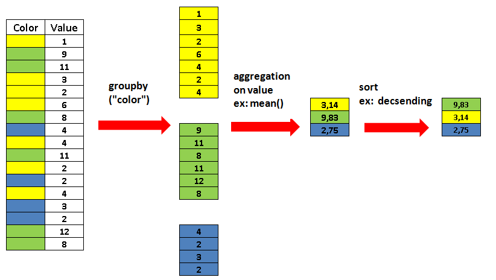

```{r, include = FALSE}
source("../bin/chunk-options.R")
knitr_fig_path("01-tabular-data-pandas-")
library(reticulate)
```
## Read data

We use [Pandas](https://pandas.pydata.org/) for reading, writing, and handling tabular data in Python as it is the _de facto_ standard tool to do so.

Just as `np` is by convention the alias for `numpy`, so is `pd` for `pandas`.

```{python}
import pandas as pd
```

We start by reading some data from a comma-separated values ([CSV](https://en.wikipedia.org/wiki/Comma-separated_values)) file.

```{python}
growth = pd.read_csv("data/yeast-growth.csv")
```

### Inspect your data

Depending on your current Python environment a `pandas.DataFrame` object will automatically be displayed as text formatted to a table or as a prettier [HTML](https://en.wikipedia.org/wiki/HTML) table.

```{python}
growth
```

By default, the output is configured to not show too many rows and columns. We can access more specific parts of a data frame using specific methods.

The beginning of a data frame can be accessed with the `head` method.

```{python}
growth.head()
```

Correspondingly, the end of a data frame can be accessed with the `tail` method.

```{python}
growth.tail()
```

You can also ask for a random number of rows. This is great for inspection since you have a chance to see rows from different parts of the data frame. It can also be convenient to develop an analysis with a subset of your data first because it will be faster (this matters if you work with tables that contain millions of rows).

```{python}
growth.sample(10)
```

Notice the random indices.

### Summaries

Looking at the actual values in your data is important to develop an understanding of them if you work with new data. However, in order to get an overview on your data, there are some useful summary methods.

If you just want to know the dimensions of your data frame, you can do so with the `shape` attribute.

```{python}
growth.shape
```

As you will see later on, it is sometimes necessary to look at the data types that pandas has inferred from your table.

```{python}
growth.dtypes
```

The `info` method conveniently combines information on the shape and types in your data frame. In addition, it tells you about the index used and the memory consumption.

```{python}
growth.info()
```

Instead of summarizing the data frame object itself, you can get a high-level overview on the statistical distribution of your data.

```{python}
growth.describe()
```

By default, this will only describe numeric columns. You can also get an overview on all columns including text and categorical columns (generally of type `object`).

```{python}
growth.describe(include="all")
```

The `NaN` values displayed in the output are simply Pandas' concept of missing values. Just pretend that they are empty cells.

> ## Wording
>
> I try to use _data frame_ when talking about the object for computation and _table_ when talking about data more generally; but I might mix them up as in my mind they are the same concept.
{: .callout}

> ## Tangent: Tidy Data
>
> Hadley Wickham coined the concept of _tidy data_ for statistics. What _is_ tidy data?
>
> <iframe src="https://tidyr.tidyverse.org/articles/tidy-data.html#tidy-data" height="600" width="100%" data-external="1"></iframe>
>
> You can also dive into the [original publication from 2014](https://doi.org/10.18637/jss.v059.i10) but it suffices to say that a tidy data structure is more intuitive for data visualization (plotting) and statistical analysis.
{: .callout}

> ## Reading files from different locales
>
> Depending on what country's standard your computer is set to (the 'locale'), software such as Excel will use different characters to separate fields, for example, the default for a computer with the DK locale will be to use `;` to separate fields and `,` to separate decimals. Try finding the right arguments to `pandas.read_table` to get something sensible out of `"data/example-uk.txt"` and `"data/example-dk.txt"`. Use the inspection methods from before to see how pandas reads the data.
>
> ### UK
>
> > ## Solution
> >
> > ```{python}
> > uk_data = pd.read_table("data/example-uk.txt")
> > uk_data
> > > > ```
> >
> > ```{python}
> > uk_data = pd.read_table("data/example-uk.txt", sep=";")
> > uk_data
> > > > ```
> >
> > ```{python}
> > uk_data.dtypes
> > > > ```
> >
> > ```{python}
> > uk_data = pd.read_table("data/example-uk.txt", sep=";", thousands=",")
> > uk_data
> > > > ```
> >
> > ```{python}
> > uk_data.dtypes
> > > > ```
> >
> {: .solution}
>
> ### DK
>
> > ## Solution
> > 
> > ```{python}
> > dk_data = pd.read_table("data/example-dk.txt")
> > dk_data
> > ```
> > 
> > ```{python}
> > dk_data = pd.read_table("data/example-dk.txt", sep=";")
> > dk_data
> > ```
> > 
> > ```{python}
> > dk_data.dtypes
> > ```
> > 
> > ```{python}
> > dk_data = pd.read_table("data/example-dk.txt", sep=";", decimal=",")
> > dk_data
> > ```
> > 
> > ```{python}
> > dk_data.dtypes
> > ```
> > 
> {: .solution}
{: .challenge}

### Other data formats

#### Excel

When you read data from spreadsheets (`.xls`, `.xlsx`, `.ods`), you do not need to worry about field separators or number formatting (but you need extra packages such as `xlrd`, `openpyxl`, or `odfpy`).

```{python}
excel_data = pd.read_excel("data/example-dk.xlsx")
excel_data
```

However, you may need to be careful with Excel's interpretation of strings as dates (see [Gene name errors are widespread in the scientific literature](https://doi.org/10.1186/s13059-016-1044-7) and [Guidelines for human gene nomenclature](https://doi.org/10.1038/s41588-020-0669-3)) when loading tabular files in Excel.

Pandas will try to detect the right dependency for opening a spreadsheet.


```{python}
date_data = pd.read_excel("data/example-datetime.ods")
date_data
```

Common date and time formats are automatically detected and converted to
suitable Python data types.

```{python}
date_data.dtypes
```

You can conveniently combine multiple columns into one datetime object.

```{python}
pd.read_excel("data/example-datetime.ods", parse_dates={"datetime": ["date", "time"]})
```

#### Further formats

There are many more formats that Pandas can read data from. Just type `pd.read_`
and press tab to see the list of auto-completion options. A few notable ones:

* All file-based read functions accept a remote URL as an option. We could have loaded the growth data with

```{python}
pd.read_csv(
    "https://raw.githubusercontent.com/data-science-for-biotech/python-pandas-viz-ml/gh-pages/_episodes_rmd/data/yeast-growth.csv"
)
```

* In the context of the web, `read_json` can be very handy
* Tables are often stored in SQL databases, in that case `read_sql` is your friend

## Accessing data

Let's look at our old friend the growth data table again.

```{python}
growth
```

### By label

We can access individual columns (`pandas.Series`) by their names as string.

```{python}
growth["od"]
```

Notice how the display of series is different from data frames.

We can make powerful label based selections with the `loc` attribute.

```{python}
growth.loc[:, "od"]
```

Our data frames have two dimensions: the rows and columns. Here, we specify that
we want all rows `:` and a single column `"od"`. We can also select one or more
columns as a list which will always return a data frame.

```{python}
growth.loc[:, ["od"]]
```

We use `at` to access an individual element with labels.

```{python}
growth.at[451, "od"]
```

### By index

We might be tempted to access a column by its index position directly.

```{python}
growth[2]
```

This does not work. Only labels are allowed here. Instead we use `iloc` for
index location.

```{python}
growth.iloc[:, 2]
```

Again, we can select one or more columns as a data frame.

```{python}
growth.iloc[:, [2]]
```

We can also access individual elements.

```{python}
growth.iat[451, 2]
```

### By slices

We can also define label-based ranges over rows and columns.

```{python}
growth.loc[:, "od":"concentration"]
```

```{python}
growth.loc[10:15, :]
```

> ## `loc`
>
> Be careful that in label-based accession with `loc`, ranges are inclusive
> unlike numeric ranges in Python in general. Also be aware that since we have
> an integer index here, the label coincides with the index position.
{: .callout}

```{python}
growth.iloc[10:15, :]
```

**N.B.: Index location ranges are exclusive.**

### By conditions

Pandas inherits from numpy the conditional selection of elements. These are
essentially Boolean series or data frames known as masks.

```{python}
growth[growth["od"] > 0.2]
```

These masks can be combined using Boolean logic, making them very powerful
tools for selecting just the right data.

```{python}
growth[(growth["od"] > 0.2) & (growth["concentration_level"] == "medium")]
```

You can combine masks with `loc` to also sub-select columns.

```{python}
growth.loc[(growth["od"] > 0.2) & (growth["concentration_level"] == "medium"), ["od", "timepoint"]]
```

Sometimes these conditions can be tedious to write, use the `query` method for a
shorter form. **Be careful, `query` uses Python's condition logic, not numpy's.**

```{python}
growth.query("od > 0.2 and concentration_level == 'medium'")
```

`query` is fancy enough to know how to use variables.

```{python}
threshold = 0.2

growth.query("od > @threshold and concentration_level == 'medium'")
```

### Views

Selecting a subset of your data frame by any of the previous means creates a
view on that part of the data frame. This is faster since the data is not copied
and lets you change elements in a part of the table. **Be careful that this may
lead to unintended consequences.**

```{python}
growth.loc[0:5, :] = None
```

```{python}
growth.head(10)
```

A comprehensive tutorial can be found [in the Pandas documentation](https://pandas.pydata.org/pandas-docs/stable/user_guide/indexing.html).


## Working with data

Just like numpy, Pandas offers basic statistical methods out-of-the-box. We can
apply them to single columns,

```{python}
growth["od"].min()
```

multiple columns,

```{python}
growth[["od", "concentration"]].max()
```

or even rows.

```{python}
growth[["od", "concentration"]].mean(axis=1)
```

```{python}
growth[["od", "concentration"]].std(axis=1)
```

### Split-apply-combine

Another powerful operation and a very common strategy for data transformation is
[split, apply,
combine](https://pandas.pydata.org/pandas-docs/stable/user_guide/groupby.html).
This pattern is provided by pandas in the form of the `groupby` method.



<figcaption align="center">

<a href="https://towardsdatascience.com/11-examples-to-master-pandas-groupby-function-86e0de574f38">Image credit</a>

</figcaption>

```{python}
growth.groupby("well")[["od", "concentration"]].mean()
```

> ## Cleaning messy data
>
> Can you transform this messy table into a tidy one? You may need the
> [`melt`](https://pandas.pydata.org/pandas-docs/stable/reference/api/pandas.melt.html)
> function to change the table layout.
> 
> ```{python}
> messy = pd.read_csv("data/yeast-growth-messy.csv")
> ```
> 
> > ## Solution
> > 
> > ```{python}
> > messy
> > ```
> > 
> > ```{python}
> > messy.columns
> > ```
> > 
> > ```{python}
> > del messy["V1"]
> > ```
> > 
> > ```{python}
> > from string import ascii_lowercase
> > ```
> > 
> > ```{python}
> > messy["well"] = list(ascii_lowercase[:len(messy)])
> > ```
> > 
> > ```{python}
> > long_data = pd.melt(messy, id_vars=["V2", "V3", "well"])
> > long_data
> > ```
> > 
> > ```{python}
> > long_data["variable"].replace(dict(zip(long_data["variable"].unique(), range(1, len(long_data["variable"].unique()) + 1))), inplace=True)
> > ```
> > 
> > ```{python}
> > long_data.rename(columns={"V2": "concentration_level", "V3": "concentration", "variable": "timepoint"}, inplace=True)
> > ```
> > 
> > ```{python}
> > long_data
> > ```
> >
> {: .solution}
{: .challenge}

## Tangent: Extract, Transform, Load (ETL)

The process we have just seen is known as _extract_, _transform_, _load_ or simply [ETL](https://en.wikipedia.org/wiki/Extract,_transform,_load). It describes the ubiquitous data workflow of reading data (extract with, for example, `pd.read_csv`), cleaning up the data (transform) as we have done with the messy growth curves above, and storing the tidy data again for subsequent use (load with, for example, `to_excel`).

## Outlook

* Tidy pandas data frames are excellent structures for visualizing data, either with the [built-in methods](https://pandas.pydata.org/docs/getting_started/intro_tutorials/04_plotting.html) or other packages. This will be part of the [next episode](../02-data-visualization/index.html).
* The package [statsmodels](https://www.statsmodels.org/stable/index.html) can be used to fit statistical models to tidy data frames in a convenient fashion using `R`-style formulas.
* Data frames due to their column names are more descriptive than pure numeric matrices (`numpy.ndarray`) which is handy in many tasks, for example, in machine learning as shown in the [last episode](../03-machine-learning/index.html).
